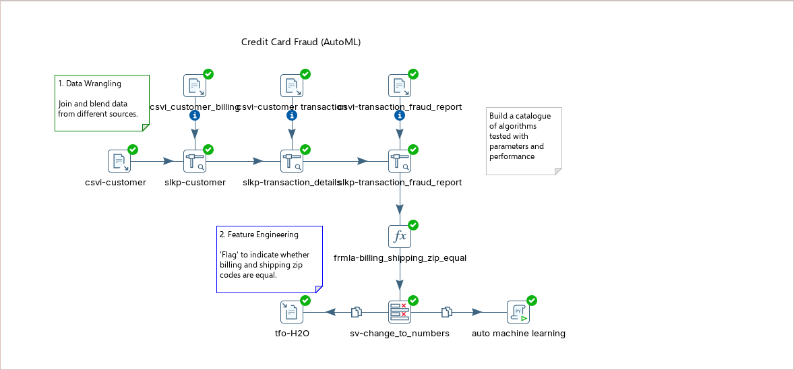

# AutoML

> **Note:** Imagine that a direct retailer wants to reduce losses due to orders involving fraudulent use of credit cards. They accept orders via phone and their website, and ship goods directly to the customer.
> 
> Basic customer details, such as customer name, date of birth, billing address and preferred shipping address, are stored in a relational database.
> 
> Orders, as they come in, are stored in a database. There is also a report of historical instances of fraud contained in a CSV spreadsheet.

> **Warning:**
>
> #### Before you start ..
> 
> You need Colab access and a working PDI environment. Do the setup first if you have not done it yet.
> 
> * Complete **Prerequisite Tasks** (the previous lab).
> * In PDI, you will run `autoML.ktr`.
>   * Location: this lab's **files** (everything ships with the lab)
> * From that transformation, you will create `data/H2O.csv`.
>   * Upload that file to Colab when prompted.

**🎥 Embed:** [Walkthrough (video)](<https://www.loom.com/share/52058cfd36b34a0286d5961ab393c9ad?hideEmbedTopBar=true&hide_owner=true&hide_share=true&hide_title=true>)

> **Note:** In this workshop, you will:
> 
> * Prepare data (wrangling).
> * Create features (feature engineering).
> * Use H2O AutoML to shortlist candidate models.
> * Train and evaluate a model in Colab.
> * Save the best model artifact.

<figure><figcaption>
AutoML
</figcaption></figure>

[Download customer.csv](./files/customer.csv)

[Download customer_billing.csv](./files/customer_billing.csv)

[Download H2O.csv](./files/H2O.csv)

[Download transaction_details.csv](./files/transaction_details.csv)

[Download transaction_fraud_report.csv](./files/transaction_fraud_report.csv)

[Download autoML.ktr](./files/autoML.ktr) <button data-launch="spoon" data-path="files/autoML.ktr">Open in Pentaho Data Integration</button> <button data-graph="files/autoML.ktr">View graph</button>

***

Run through the following steps to determine the best ML model for the dataset:

<div class="pcm-tabs-widget" data-tabs="%5B%7B%22title%22%3A%221.%20Data%20Preparation%22%2C%22body%22%3A%22%3E%20**Note%3A**%5Cn%3E%5Cn%3E%20%23%23%23%23%20Data%20preparation%5Cn%3E%20%5Cn%3E%20Use%20PDI%20to%20join%20customer%2C%20transaction%2C%20and%20historical%20fraud%20data.%20Create%20a%20single%20training%20dataset%20for%20AutoML.%5Cn%5Cn1.%20Start%20PDI%5Cn%5Cn%60%60%60bash%5Cncd%5Cncd%20~%2FPentaho%2Fdesign-tools%2Fdata-integration%5Cn.%2Fspoon.sh%20%5Cn%60%60%60%5Cn%5Cn2.%20Open%20the%20transformation%3A%20%60autoML.ktr%60%5Cn%5Cnthis%20lab's%20**files**%20(everything%20ships%20with%20the%20lab)%5Cn%5Cn%3Cfigure%3E%3Cimg%20src%3D%5C%22..%2F_assets%2Fimages%2Fautoml_data_wrangling.png%5C%22%20alt%3D%5C%22%5C%22%3E%3Cfigcaption%3E%3Cp%3Edata%20wrangling%3C%2Fp%3E%3C%2Ffigcaption%3E%3C%2Ffigure%3E%5Cn%5Cn3.%20Browse%20the%20various%20customer%20data%20sources%3A%5Cn%5Cn%5Cn%5Cn%3Cdiv%20class%3D%5C%22pcm-tabs-widget%5C%22%20data-tabs%3D%5C%22%255B%257B%2522title%2522%253A%25221.%2520customer%255C%255C_data%2522%252C%2522body%2522%253A%2522%253E%2520**Note%253A**%255Cn%253E%255Cn%253E%2520%2523%2523%2523%2523%2520**Customer%2520Data**%255Cn%253E%2520%255Cn%253E%2520Where%2520you%2520will%2520find%2520the%2520customer%255C%255C_billing%255C%255C_zip%2520codes%252C%2520which%2520will%2520be%2520used%2520in%2520feature%2520engineering%253A%255Cn%255Cn%253Cfigure%253E%253Cimg%2520src%253D%255C%2522..%252F_assets%252Fimages%252Fautoml_customer_data.png%255C%2522%2520alt%253D%255C%2522%255C%2522%253E%253Cfigcaption%253E%253Cp%253Ecustomer_data%253C%252Fp%253E%253C%252Ffigcaption%253E%253C%252Ffigure%253E%2522%257D%252C%257B%2522title%2522%253A%25222.%2520customer%255C%255C_billing%2522%252C%2522body%2522%253A%2522%253E%2520**Note%253A**%255Cn%253E%255Cn%253E%2520%2523%2523%2523%2523%2520**Customer%2520Billing**%255Cn%253E%2520%255Cn%253E%2520References%2520the%2520customer%2520transaction%2520data.%2522%257D%252C%257B%2522title%2522%253A%25223.%2520customer%255C%255C_transaction%2522%252C%2522body%2522%253A%2522%253E%2520**Note%253A**%255Cn%253E%255Cn%253E%2520%2523%2523%2523%2523%2520**Customer%2520Transaction**%255Cn%253E%2520%255Cn%253E%2520*%2520customer%2520transaction%2520details%255Cn%253E%2520*%2520feature%2520engineering%2520for%2520%2560ship_to_zip%2560%255Cn%253E%2520*%2520transaction%2520details%2520(%2560x%2560%2520features)%2520are%2520used%2520by%2520the%2520model%2520to%2520predict%2520fraud%2520(%2560y%2560%2520target).%255Cn%253E%2520*%2520boolean%2520values%2520must%2520be%2520converted%2520to%2520numbers%2520for%2520many%2520algorithms%2520(for%2520example%252C%2520Random%2520Forest).%255Cn%255Cn%253Cfigure%253E%253Cimg%2520src%253D%255C%2522..%252F_assets%252Fimages%252Fautoml_customer_transaction.png%255C%2522%2520alt%253D%255C%2522%255C%2522%253E%253Cfigcaption%253E%253Cp%253Ecustomer%2520transaction%253C%252Fp%253E%253C%252Ffigcaption%253E%253C%252Ffigure%253E%2522%257D%252C%257B%2522title%2522%253A%25224.%2520fraud%255C%255C_details%2522%252C%2522body%2522%253A%2522%253E%2520**Note%253A**%255Cn%253E%255Cn%253E%2520%2523%2523%2523%2523%2520**Fraud%2520Details**%255Cn%253E%2520%255Cn%253E%2520Indicates%2520whether%2520historically%2520the%2520transaction%2520was%2520fraudulent%253A%255Cn%255Cn%253Cfigure%253E%253Cimg%2520src%253D%255C%2522..%252F_assets%252Fimages%252Fautoml_fraud_report.png%255C%2522%2520alt%253D%255C%2522%255C%2522%253E%253Cfigcaption%253E%253Cp%253Efraud%2520report%253C%252Fp%253E%253C%252Ffigcaption%253E%253C%252Ffigure%253E%2522%257D%255D%5C%22%3E%3C%2Fdiv%3E%22%7D%2C%7B%22title%22%3A%222.%20Feature%20engineering%22%2C%22body%22%3A%22%3E%20**Note%3A**%5Cn%3E%5Cn%3E%20%23%23%23%23%20Feature%20engineering%5Cn%3E%20%5Cn%3E%20Feature%20engineering%20creates%20new%20fields%20that%20improve%20model%20signal.%20Here%2C%20you%20derive%20fields%20like%20age%2C%20order%20time-of-day%2C%20and%20zip-code%20match.%5Cn%5CnExample%20derived%20field%3A%5Cn%5Cn%60billing_shipping_zip_equal%20%3D%20%5Bcustomer_billing_zip%5D%20%3D%20%5Bship_to_zip%5D%60%5Cn%5Cn%3Cfigure%3E%3Cimg%20src%3D%5C%22..%2F_assets%2Fimages%2Fautoml_feature_engineering.png%5C%22%20alt%3D%5C%22%5C%22%3E%3Cfigcaption%3E%3Cp%3EFeature%20Engineering%3C%2Fp%3E%3C%2Ffigcaption%3E%3C%2Ffigure%3E%5Cn%5Cn%3E%20**Note%3A**%20There%20are%20steps%20for%20deriving%20additional%20fields%20that%20might%20be%20useful%20for%20predictive%20modeling.%20These%20include%20computing%20the%20customer's%20age%2C%20extracting%20the%20hour%20of%20the%20day%20the%20order%20was%20placed%2C%20and%20setting%20a%20flag%20to%20indicate%20whether%20the%20shipping%20and%20billing%20addresses%20have%20the%20same%20zip%20code.%22%7D%2C%7B%22title%22%3A%223.%20H2O%22%2C%22body%22%3A%22%3E%20**Note%3A**%5Cn%3E%5Cn%3E%20%23%23%23%23%20H2O%5Cn%3E%20%5Cn%3E%20So%2C%20what%20does%20the%20data%20scientist%20do%20at%20this%20point%3F%5Cn%3E%20%5Cn%3E%20Typically%2C%20they%20will%20want%20to%20get%20a%20feel%20for%20the%20data%20by%20examining%20simple%20summary%20statistics%20and%20visualizations%2C%20followed%20by%20applying%20quick%20techniques%20for%20assessing%20the%20relationship%20between%20individual%20attributes%20(fields)%20and%20the%20target%20of%20interest%20which%2C%20in%20this%20example%2C%20is%20the%20%60reported_as_fraud_historic%60%20field.%5Cn%3E%20%5Cn%3E%20Following%20that%2C%20if%20there%20are%20attributes%20that%20look%20promising%2C%20quick%20tests%20with%20common%20supervised%20classification%20algorithms%20will%20be%20next%20on%20the%20list.%20This%20comprises%20the%20initial%20stages%20of%20experimental%20data%20mining%20%E2%80%93%20that%20is%2C%20the%20process%20of%20determining%20which%20predictive%20techniques%20are%20going%20to%20give%20the%20best%20result%20for%20a%20given%20problem.%5Cn%5Cn%5Cn%5Cn%3Cdiv%20class%3D%5C%22pcm-tabs-widget%5C%22%20data-tabs%3D%5C%22%255B%257B%2522title%2522%253A%25221.%2520Dataset%2522%252C%2522body%2522%253A%2522**Create%2520the%2520H2O%2520dataset**%255Cn%255Cn1.%2520Run%2520the%2520transformation%253A%2520autoML.ktr%255Cn2.%2520Preview%2520the%2520results%253A%2520%2560data%252FH2O.csv%2560%255Cn%255Cn%253Cfigure%253E%253Cimg%2520src%253D%255C%2522..%252F_assets%252Fimages%252Fautoml_h2o_dataset.png%255C%2522%2520alt%253D%255C%2522%255C%2522%253E%253Cfigcaption%253E%253Cp%253EH2O.csv%253C%252Fp%253E%253C%252Ffigcaption%253E%253C%252Ffigure%253E%255Cn%255Cn%253E%2520**Note%253A**%2520This%2520will%2520be%2520the%2520dataset%2520used%2520for%2520autoML%2520in%2520Colab.%2522%257D%252C%257B%2522title%2522%253A%25222.%2520H2O%2522%252C%2522body%2522%253A%2522%253E%2520**Note%253A**%2520H2O%2520AutoML%2520trains%2520and%2520ranks%2520multiple%2520models%2520for%2520you.%2520It%2520also%2520builds%2520ensembles%2520and%2520returns%2520a%2520leaderboard%252C%2520so%2520you%2520can%2520pick%2520a%2520strong%2520baseline%2520quickly.%255Cn%255Cn%253Cdiv%2520class%253D%255C%2522pcm-embed-card%255C%2522%2520data-href%253D%255C%2522https%253A%252F%252Fwww.loom.com%252Fshare%252F4a72fd0bf16446a7b7c742474ad242c0%253FhideEmbedTopBar%253Dtrue%2526hide_owner%253Dtrue%2526hide_share%253Dtrue%2526hide_title%253Dtrue%255C%2522%2520data-title%253D%255C%2522loom.com%255C%2522%253E%253C%252Fdiv%253E%255Cn%255Cn**Step%25201.**%2520**Open%2520Colab**%255Cn%255CnSign%2520in%2520to%2520Colab%253A%255Cn%255Cn%253Cdiv%2520class%253D%255C%2522pcm-embed-card%255C%2522%2520data-href%253D%255C%2522https%253A%252F%252Fcolab.research.google.com%252F%255C%2522%2520data-title%253D%255C%2522colab.research.google.com%255C%2522%253E%253C%252Fdiv%253E%255Cn%255Cn%255Cn%255Cn%255Cn%255Cn**Step%25202.**%2520**Connect%2520a%2520runtime**%255Cn%255CnConnect%2520to%2520a%2520hosted%2520runtime.%255Cn%255Cn%253Cfigure%253E%253Cimg%2520src%253D%255C%2522..%252F_assets%252Fimages%252Fautoml_colab_runtime.png%255C%2522%2520alt%253D%255C%2522%255C%2522%253E%253Cfigcaption%253E%253Cp%253EColab%2520hosted%2520runtime%253C%252Fp%253E%253C%252Ffigcaption%253E%253C%252Ffigure%253E%255Cn%255Cn%255Cn%255Cn%255Cn%255Cn**Step%25203.**%2520**Upload%2520the%2520notebook**%255Cn%255CnIn%2520Colab%252C%2520select%2520**File%2520%253E%2520Upload%2520notebook**.%255Cn%255CnUpload%253A%255Cn%255Cn%2560~%252FWorkshop--Data-Integration%252FLabs%252FModule%25207%2520-%2520Use%2520Cases%252FMachine%2520Learning%252FAutoML%252Fdata%252Fcredit_card_fraud.ipynb%2560%255Cn%255Cn%253Cfigure%253E%253Cimg%2520src%253D%255C%2522..%252F_assets%252Fimages%252Fautoml_colab_upload_notebook.png%255C%2522%2520alt%253D%255C%2522%255C%2522%253E%253Cfigcaption%253E%253Cp%253EUpload%2520notebook%253C%252Fp%253E%253C%252Ffigcaption%253E%253C%252Ffigure%253E%255Cn%255Cn%255Cn%255Cn%255Cn%255Cn**Step%25204.**%2520**Upload%2520the%2520dataset**%255Cn%255CnWhen%2520the%2520notebook%2520prompts%2520for%2520a%2520file%2520upload%252C%2520upload%2520%2560H2O.csv%2560.%2520Create%2520it%2520by%2520running%2520%2560autoML.ktr%2560%2520in%2520PDI.%255Cn%255Cn***%255Cn%255Cn**AutoML%2520Script**%255Cn%255CnThese%2520are%2520the%2520code%2520sections%2520for%2520the%2520Jupyter%2520file%253A%2520%2560credit_card_fraud.ipynb%2560%253A%255Cn%255Cn1.%2520Install%2520the%2520h2o%2520libraries%253A%255Cn%255Cn%2560%2560%2560python%255Cn%2523%2520Install%2520H2O%255Cn!pip%2520install%2520h2o%2520-q%255Cnprint(%255C%2522Installation%2520complete.%255C%2522)%255Cn%2560%2560%2560%255Cn%255Cn%253E%2520**Note%253A**%2520*%2520Installs%2520H2O.ai's%2520machine%2520learning%2520platform%255Cn%253E%2520*%2520%2560-q%2560%2520flag%2520%253D%2520quiet%2520mode%2520(minimal%2520output)%255Cn%255Cn2.%2520Import%2520libraries%253A%255Cn%255Cn%2560%2560%2560python%255Cn%2523%2520Import%2520libraries%255Cnimport%2520h2o%255Cnfrom%2520h2o.automl%2520import%2520H2OAutoML%255Cnimport%2520pandas%2520as%2520pd%255Cnimport%2520numpy%2520as%2520np%255Cnfrom%2520datetime%2520import%2520datetime%255Cnimport%2520matplotlib.pyplot%2520as%2520plt%255Cnimport%2520seaborn%2520as%2520sns%255Cn%255Cn%2523%2520Initialize%2520H2O%255Cnh2o.init(max_mem_size%253D'4G'%252C%2520nthreads%253D-1)%255Cnprint(%255C%2522%255C%255CnH2O%2520initialized.%255C%2522)%255Cn%2520%2520%2520%2520%2520%255Cn%2560%2560%2560%255Cn%255Cn%253E%2520**Note%253A**%2520*%2520%2560max_mem_size%253D'4G'%2560%253A%2520Allocates%25204GB%2520RAM%2520to%2520H2O%2520cluster%255Cn%253E%2520*%2520%2560nthreads%253D-1%2560%253A%2520Uses%2520all%2520available%2520CPU%2520cores%255Cn%255Cn3.%2520Upload%2520data%253A%255Cn%255Cn%2560%2560%2560py%255Cn%2523%2520Upload%2520data%255Cnfrom%2520google.colab%2520import%2520files%255Cnuploaded%2520%253D%2520files.upload()%255Cn%2560%2560%2560%255Cn%255Cn%253E%2520**Note%253A**%2520**Purpose**%253A%2520Interactive%2520file%2520upload%2520widget%2520in%2520Google%2520Colab%255Cn%253E%2520%255Cn%253E%2520**Expected%2520file**%253A%2520H2O%2560.csv%2560%2520(semicolon-separated)%255Cn%255Cn%253Cfigure%253E%253Cimg%2520src%253D%255C%2522..%252F_assets%252Fimages%252Fautoml_colab_upload_data.png%255C%2522%2520alt%253D%255C%2522%255C%2522%253E%253Cfigcaption%253E%253C%252Ffigcaption%253E%253C%252Ffigure%253E%255Cn%255Cn4.%2520Load%2520data%253A%255Cn%255Cn%2560%2560%2560py%255Cn%2523%2520Load%2520data%255Cndata%2520%253D%2520pd.read_csv('H2O.csv'%252C%2520sep%253D'%253B'%252C%2520engine%253D'python'%252C%2520header%253DNone)%255Cn%255Cndata.columns%2520%253D%2520%255B%255Cn%2520%2520%2520%2520'first_time_customer'%252C%2520'order_dollar_amount'%252C%2520'num_items'%252C%2520'age'%252C%255Cn%2520%2520%2520%2520'web_order'%252C%2520'total_transactions'%252C%2520'hour_of_day'%252C%255Cn%2520%2520%2520%2520'billing_shipping_match'%252C%2520'fraud'%255Cn%255D%255Cn%255Cn%2523%2520Convert%2520target%2520to%2520string%255Cndata%255B'fraud'%255D%2520%253D%2520data%255B'fraud'%255D.astype(str)%255Cn%255Cnprint(f%255C%2522Dataset%253A%2520%257Bdata.shape%255B0%255D%253A%252C%257D%2520rows%2520%25C3%2597%2520%257Bdata.shape%255B1%255D%257D%2520columns%255C%2522)%255Cnprint(f%255C%2522Fraud%2520cases%253A%2520%257B(data%255B'fraud'%255D%253D%253D'1').sum()%253A%252C%257D%2520(%257B(data%255B'fraud'%255D%253D%253D'1').mean()*100%253A.2f%257D%2525)%255C%2522)%255Cn%2560%2560%2560%255Cn%255Cn%253E%2520**Note%253A**%2520**Critical%2520steps**%253A%255Cn%253E%2520%255Cn%253E%25201.%2520**Custom%2520separator**%253A%2520Uses%2520%2560%253B%2560%2520instead%2520of%2520default%2520%2560%252C%2560%255Cn%253E%25202.%2520**Manual%2520column%2520naming**%253A%2520Original%2520file%2520has%2520no%2520headers%255Cn%253E%25203.%2520**Target%2520conversion**%253A%2520Converts%2520%2560fraud%2560%2520to%2520string%2520for%2520H2O%2520classification%255Cn%253E%2520%255Cn%253E%2520**Feature%2520breakdown**%253A%255Cn%253E%2520%255Cn%253E%2520*%2520%2560first_time_customer%2560%253A%2520Binary%2520indicator%2520(risky%2520for%2520fraud)%255Cn%253E%2520*%2520%2560order_dollar_amount%2560%253A%2520Transaction%2520value%255Cn%253E%2520*%2520%2560num_items%2560%253A%2520Cart%2520size%255Cn%253E%2520*%2520%2560age%2560%253A%2520Customer%2520age%255Cn%253E%2520*%2520%2560web_order%2560%253A%2520Online%2520vs%2520in-store%255Cn%253E%2520*%2520%2560total_transactions%2560%253A%2520Customer%2520history%255Cn%253E%2520*%2520%2560hour_of_day%2560%253A%2520Timing%2520patterns%2520(fraud%2520often%2520occurs%2520at%2520odd%2520hours)%255Cn%253E%2520*%2520%2560billing_shipping_match%2560%253A%2520Address%2520mismatch%2520(major%2520fraud%2520signal)%255Cn%253E%2520*%2520%2560fraud%2560%253A%2520Target%2520variable%2520(0%253Dlegitimate%252C%25201%253Dfraud)%255Cn%255Cn%253E%2520**Warning%253A**%2520Your%2520upstream%2520transformation%2520may%2520use%2520a%2520different%2520target%2520field%2520name%2520(for%2520example%252C%2520%2560reported_as_fraud_historic%2560).%2520In%2520this%2520notebook%252C%2520the%2520target%2520column%2520is%2520named%2520%2560fraud%2560.%255Cn%255Cn5.%2520Distribution%2520check%253A%255Cn%255Cn%2560%2560%2560py%255Cn%2523%2520Quick%2520class%2520distribution%2520check%255Cnfraud_dist%2520%253D%2520data%255B'fraud'%255D.value_counts()%255Cn%255Cnplt.figure(figsize%253D(10%252C%25204))%255Cnfraud_dist.plot(kind%253D'bar'%252C%2520color%253D%255B'green'%252C%2520'red'%255D)%255Cnplt.title('Class%2520Distribution'%252C%2520fontweight%253D'bold')%255Cnplt.xlabel('Class%2520(0%253DNormal%252C%25201%253DFraud)')%255Cnplt.ylabel('Count')%255Cnplt.xticks(%255B0%252C%25201%255D%252C%2520%255B'Normal'%252C%2520'Fraud'%255D%252C%2520rotation%253D0)%255Cnfor%2520i%252C%2520v%2520in%2520enumerate(fraud_dist)%253A%255Cn%2520%2520%2520%2520plt.text(i%252C%2520v%2520%252B%252050%252C%2520f'%257Bv%253A%252C%257D'%252C%2520ha%253D'center'%252C%2520fontweight%253D'bold')%255Cnplt.tight_layout()%255Cnplt.show()%255Cn%2560%2560%2560%255Cn%255Cn%253E%2520**Note%253A**%2520**Purpose**%253A%2520Reveals%2520class%2520imbalance%255Cn%253E%2520%255Cn%253E%2520**Why%2520this%2520matters**%253A%255Cn%253E%2520%255Cn%253E%2520*%2520Fraud%2520datasets%2520are%2520typically%2520**highly%2520imbalanced**%2520(99%2525%2520legitimate%252C%25201%2525%2520fraud)%255Cn%253E%2520*%2520This%2520visualization%2520confirms%2520the%2520need%2520for%2520%2560balance_classes%253DTrue%2560%2520later%255Cn%253E%2520*%2520Shows%2520if%2520we%2520have%2520enough%2520fraud%2520cases%2520to%2520train%2520effectively%255Cn%255Cn6.%2520Convert%2520to%2520H2O%2520frame%253A%255Cn%255Cn%2560%2560%2560py%255Cn%2523%2520Convert%2520to%2520H2O%2520frame%255Cnhf%2520%253D%2520h2o.H2OFrame(data)%255Cnhf%255B'fraud'%255D%2520%253D%2520hf%255B'fraud'%255D.asfactor()%255Cn%255Cn%2523%2520Split%253A%252075%2525%2520train%252C%252025%2525%2520test%255Cntrain%252C%2520test%2520%253D%2520hf.split_frame(ratios%253D%255B0.75%255D%252C%2520seed%253D42)%255Cn%255Cnprint(f%255C%2522Training%253A%2520%257Btrain.nrows%253A%252C%257D%2520rows%255C%2522)%255Cnprint(f%255C%2522Test%253A%2520%2520%2520%2520%2520%257Btest.nrows%253A%252C%257D%2520rows%255C%2522)%255Cn%255Cn%2523%2520Define%2520features%2520and%2520target%255Cnx%2520%253D%2520train.columns%255Cnx.remove('fraud')%255Cny%2520%253D%2520'fraud'%255Cn%2560%2560%2560%255Cn%255Cn%253E%2520**Note%253A**%2520**Key%2520operations**%253A%255Cn%253E%2520%255Cn%253E%25201.%2520**H2OFrame%2520conversion**%253A%2520Moves%2520data%2520into%2520H2O's%2520distributed%2520framework%255Cn%253E%25202.%2520**Factor%2520conversion**%253A%2520Tells%2520H2O%2520this%2520is%2520classification%2520(not%2520regression)%255Cn%253E%25203.%2520**75%252F25%2520split**%253A%2520Standard%2520training%252Ftesting%2520division%255Cn%253E%25204.%2520**Seed%253D42**%253A%2520Ensures%2520reproducible%2520results%2520-%2520controls%2520randomness%255Cn%253E%25205.%2520**Feature%252Ftarget%2520separation**%253A%2520Prepares%2520for%2520model%2520training%255Cn%253E%2520%255Cn%253E%2520**Why%2520this%2520split%253F**%253A%255Cn%253E%2520%255Cn%253E%2520*%252075%2525%2520gives%2520enough%2520data%2520to%2520learn%2520patterns%255Cn%253E%2520*%252025%2525%2520provides%2520robust%2520performance%2520estimates%255Cn%253E%2520*%2520Random%2520splitting%2520prevents%2520temporal%2520bias%255Cn%255Cn7.%2520Run%2520Models%2520(Top%25205)%255Cn%255Cn%2560%2560%2560py%255Cn%2523%2520Fast%2520configuration%255Cnstart_time%2520%253D%2520datetime.now()%255Cn%255Cnprint(%255C%2522%255C%255CnFAST%2520H2O%2520AutoML%255C%2522)%255Cnprint(%255C%2522%253D%255C%2522*70)%255Cnprint(%255C%2522Configuration%253A%255C%2522)%255Cnprint(%255C%2522%2520%2520Max%2520models%253A%25205%2520(for%2520speed)%255C%2522)%255Cnprint(%255C%2522%2520%2520Max%2520runtime%253A%252015%2520minutes%255C%2522)%255Cnprint(%255C%2522%2520%2520Algorithms%253A%2520GBM%252C%2520XGBoost%252C%2520GLM%252C%2520DRF%252C%2520DeepLearning%255C%2522)%255Cnprint(%255C%2522%2520%2520Balance%2520classes%253A%2520True%255C%2522)%255Cnprint(%255C%2522%255C%255CnTraining...%255C%255Cn%255C%2522)%255Cn%255Cnaml%2520%253D%2520H2OAutoML(%255Cn%2520%2520%2520%2520max_models%253D5%252C%2520%2520%2520%2520%2520%2520%2520%2520%2520%2520%2520%2520%2520%2520%2520%2520%2520%2520%2520%2523%2520Only%25205%2520models%2520for%2520speed%255Cn%2520%2520%2520%2520max_runtime_secs%253D900%252C%2520%2520%2520%2520%2520%2520%2520%2520%2520%2520%2520%2523%252015%2520minutes%2520max%255Cn%2520%2520%2520%2520seed%253D42%252C%255Cn%2520%2520%2520%2520balance_classes%253DTrue%252C%2520%2520%2520%2520%2520%2520%2520%2520%2520%2520%2520%2523%2520Handle%2520imbalanced%2520data%255Cn%2520%2520%2520%2520nfolds%253D5%252C%2520%2520%2520%2520%2520%2520%2520%2520%2520%2520%2520%2520%2520%2520%2520%2520%2520%2520%2520%2520%2520%2520%2520%2523%25205-fold%2520CV%255Cn%2520%2520%2520%2520sort_metric%253D'AUC'%252C%255Cn%255Cn%2520%2520%2520%2520%2523%2520Best%2520algorithms%2520for%2520fraud%2520detection%255Cn%2520%2520%2520%2520include_algos%253D%255B%255Cn%2520%2520%2520%2520%2520%2520%2520%2520'GBM'%252C%2520%2520%2520%2520%2520%2520%2520%2520%2520%2520%2520%2523%2520Gradient%2520Boosting%2520(usually%2520best)%255Cn%2520%2520%2520%2520%2520%2520%2520%2520'XGBoost'%252C%2520%2520%2520%2520%2520%2520%2520%2523%2520Extreme%2520Gradient%2520Boosting%255Cn%2520%2520%2520%2520%2520%2520%2520%2520'GLM'%252C%2520%2520%2520%2520%2520%2520%2520%2520%2520%2520%2520%2523%2520Generalized%2520Linear%2520Model%2520(fast)%255Cn%2520%2520%2520%2520%2520%2520%2520%2520'DRF'%252C%2520%2520%2520%2520%2520%2520%2520%2520%2520%2520%2520%2523%2520Distributed%2520Random%2520Forest%2520(tree-based)%255Cn%2520%2520%2520%2520%2520%2520%2520%2520'DeepLearning'%2520%2520%2520%2523%2520Neural%2520Network%255Cn%2520%2520%2520%2520%255D%252C%255Cn%255Cn%2520%2520%2520%2520verbosity%253D'info'%255Cn)%255Cn%255Cn%2523%2520Train%255Cnaml.train(x%253Dx%252C%2520y%253Dy%252C%2520training_frame%253Dtrain)%255Cn%255Cnduration%2520%253D%2520(datetime.now()%2520-%2520start_time).total_seconds()%255Cnprint(f%255C%2522%255C%255CnTraining%2520completed%2520in%2520%257Bduration%252F60%253A.1f%257D%2520minutes.%255C%2522)%255Cnprint(%255C%2522%253D%255C%2522*70)%255Cn%2560%2560%2560%255Cn%255Cn**Configuration%2520explained**%253A%255Cn%255Cn*%2520%2560max_models%253D5%2560%253A%2520keeps%2520runtime%2520short.%255Cn*%2520%2560max_runtime_secs%253D900%2560%253A%2520hard%2520stop%2520at%252015%2520minutes.%255Cn*%2520%2560balance_classes%253DTrue%2560%253A%2520important%2520for%2520imbalanced%2520fraud%2520data.%255Cn*%2520%2560nfolds%253D5%2560%253A%2520cross-validation%2520for%2520more%2520stable%2520metrics.%255Cn*%2520%2560sort_metric%253D'AUC'%2560%253A%2520simple%2520default%2520ranking%2520metric.%255Cn%255Cn%253E%2520**Note%253A**%2520**Algorithm%2520selection%2520rationale**%253A%255Cn%253E%2520%255Cn%253E%25201.%2520**GBM%2520(Gradient%2520Boosting%2520Machine)**%255Cn%253E%2520%2520%2520%2520*%2520Usually%2520%25231%2520performer%2520for%2520fraud%255Cn%253E%2520%2520%2520%2520*%2520Handles%2520complex%2520patterns%255Cn%253E%2520%2520%2520%2520*%2520Native%2520H2O%2520implementation%255Cn%253E%25202.%2520**XGBoost**%255Cn%253E%2520%2520%2520%2520*%2520Industry%2520standard%2520for%2520tabular%2520data%255Cn%253E%2520%2520%2520%2520*%2520Fast%2520training%255Cn%253E%2520%2520%2520%2520*%2520Excellent%2520with%2520imbalanced%2520data%255Cn%253E%25203.%2520**GLM%2520(Generalized%2520Linear%2520Model)**%255Cn%253E%2520%2520%2520%2520*%2520Fast%2520baseline%255Cn%253E%2520%2520%2520%2520*%2520Interpretable%2520coefficients%255Cn%253E%2520%2520%2520%2520*%2520Good%2520for%2520linear%2520relationships%255Cn%253E%25204.%2520**DRF%2520(Distributed%2520Random%2520Forest)**%255Cn%253E%2520%2520%2520%2520*%2520Ensemble%2520of%2520decision%2520trees%255Cn%253E%2520%2520%2520%2520*%2520Handles%2520non-linear%2520patterns%255Cn%253E%2520%2520%2520%2520*%2520Robust%2520to%2520outliers%255Cn%253E%25205.%2520**DeepLearning**%255Cn%253E%2520%2520%2520%2520*%2520Neural%2520network%255Cn%253E%2520%2520%2520%2520*%2520Captures%2520complex%2520interactions%255Cn%253E%2520%2520%2520%2520*%2520May%2520find%2520unexpected%2520patterns%255Cn%253E%2520%255Cn%253E%2520**Why%2520no%2520standalone%2520Decision%2520Trees%253F**%255C%255C%255Cn%253E%2520Ensemble%2520methods%2520(GBM%252C%2520XGBoost%252C%2520DRF)%2520combine%2520hundreds%2520of%2520trees%252C%2520always%2520outperforming%2520single%2520trees.%255Cn%255Cn8.%2520Model%2520Leaderboard%253A%255Cn%255Cn%2560%2560%2560py%255Cn%2523%2520View%2520leaderboard%255Cnlb%2520%253D%2520aml.leaderboard%255Cnprint(%255C%2522%255C%255Cn%2520ALL%2520MODELS%2520RANKED%2520BY%2520PERFORMANCE%255C%2522)%255Cnprint(%255C%2522%253D%255C%2522*70)%255Cnprint(lb)%255Cnprint(%255C%2522%253D%255C%2522*70)%255Cnprint(f%255C%2522%255C%255Cn%2520Total%2520models%2520trained%253A%2520%257Blb.nrows%257D%255C%2522)%255Cnprint(f%255C%2522Best%2520model%253A%2520%257Blb.as_data_frame()%255B'model_id'%255D%255B0%255D%257D%255C%2522)%255Cn%2560%2560%2560%255Cn%255Cn%253E%2520**Note%253A**%2520**Output%2520includes**%253A%255Cn%253E%2520%255Cn%253E%2520*%2520Model%2520IDs%255Cn%253E%2520*%2520**AUC**%2520(Area%2520Under%2520ROC%2520Curve)%255Cn%253E%2520*%2520**AUCPR**%2520(Area%2520Under%2520Precision-Recall%2520Curve)%255Cn%253E%2520*%2520**Mean%2520per-class%2520error**%255Cn%253E%2520*%2520**RMSE%252FMSE**%2520(less%2520relevant%2520for%2520classification)%255Cn%253E%2520%255Cn%253E%2520**Best%2520metric%2520for%2520fraud**%253A%2520AUCPR%2520(handles%2520class%2520imbalance%2520better%2520than%2520AUC)%255Cn%255Cn9.%2520Get%2520Best%2520Model%253A%255Cn%255Cn%2560%2560%2560python%255Cn%2523%2520Get%2520best%2520model%255Cnbest%2520%253D%2520aml.leader%255Cn%255Cnprint(f%255C%2522%255C%255Cn%2520BEST%2520MODEL%253A%2520%257Bbest.model_id%257D%255C%2522)%255Cnprint(f%255C%2522Algorithm%253A%2520%257Bbest.algo%257D%255C%2522)%255Cn%255Cn%2523%2520Performance%2520on%2520test%2520set%255Cnperf%2520%253D%2520best.model_performance(test)%255Cn%255Cnprint(%255C%2522%255C%255Cn%2520TEST%2520SET%2520PERFORMANCE%255C%2522)%255Cnprint(%255C%2522%253D%255C%2522*70)%255Cnprint(f%255C%2522AUC%253A%2520%2520%2520%2520%2520%2520%2520%257Bperf.auc()%253A.4f%257D%255C%2522)%255Cnprint(f%255C%2522Accuracy%253A%2520%2520%257Bperf.accuracy()%255B0%255D%255B1%255D%253A.4f%257D%255C%2522)%255Cnprint(f%255C%2522Precision%253A%2520%257Bperf.precision()%255B0%255D%255B1%255D%253A.4f%257D%255C%2522)%255Cnprint(f%255C%2522Recall%253A%2520%2520%2520%2520%257Bperf.recall()%255B0%255D%255B1%255D%253A.4f%257D%255C%2522)%255Cnprint(f%255C%2522F1%2520Score%253A%2520%2520%257Bperf.F1()%255B0%255D%255B1%255D%253A.4f%257D%255C%2522)%255Cnprint(%255C%2522%253D%255C%2522*70)%255Cn%2560%2560%2560%255Cn%255Cn%253E%2520**Note%253A**%2520**Metrics%2520explained%2520for%2520fraud%2520detection**%253A%255Cn%253E%2520%255Cn%253E%2520*%2520**AUC%2520(0.95%252B%2520is%2520excellent)**%253A%2520Overall%2520discrimination%2520ability%255Cn%253E%2520*%2520**Accuracy**%253A%2520Misleading%2520with%2520imbalanced%2520data%2520(can%2520be%2520high%2520even%2520missing%2520all%2520fraud)%255Cn%253E%2520*%2520**Precision**%253A%2520Of%2520flagged%2520transactions%252C%2520what%2520%2525%2520are%2520actually%2520fraud%253F%255Cn%253E%2520*%2520**Recall**%253A%2520Of%2520all%2520fraud%2520cases%252C%2520what%2520%2525%2520did%2520we%2520catch%253F%2520(**Most%2520critical%2520for%2520fraud**)%255Cn%253E%2520*%2520**F1%2520Score**%253A%2520Balance%2520between%2520precision%2520and%2520recall%255Cn%253E%2520%255Cn%253E%2520**Real-world%2520tradeoff**%253A%255Cn%253E%2520%255Cn%253E%2520*%2520High%2520recall%2520%253D%2520catch%2520more%2520fraud%2520(but%2520more%2520false%2520alarms)%255Cn%253E%2520*%2520High%2520precision%2520%253D%2520fewer%2520false%2520alarms%2520(but%2520miss%2520more%2520fraud)%255Cn%255Cn10.%2520Confusion%2520Matrix%253A%255Cn%255Cn%2560%2560%2560python%255Cn%2523%2520Confusion%2520matrix%255Cncm%2520%253D%2520perf.confusion_matrix()%255Cnprint(%255C%2522%255C%255Cn%2520CONFUSION%2520MATRIX%255C%2522)%255Cnprint(%255C%2522%253D%255C%2522*70)%255Cnprint(cm)%255Cnprint(%255C%2522%253D%255C%2522*70)%255Cn%255Cn%2523%2520Extract%2520values%255Cncm_table%2520%253D%2520cm.table.as_data_frame()%255Cntry%253A%255Cn%2520%2520%2520%2520tn%2520%253D%2520int(cm_table.iloc%255B0%252C%25201%255D)%255Cn%2520%2520%2520%2520fp%2520%253D%2520int(cm_table.iloc%255B0%252C%25202%255D)%255Cn%2520%2520%2520%2520fn%2520%253D%2520int(cm_table.iloc%255B1%252C%25201%255D)%255Cn%2520%2520%2520%2520tp%2520%253D%2520int(cm_table.iloc%255B1%252C%25202%255D)%255Cn%255Cn%2520%2520%2520%2520print(%255C%2522%255C%255Cn%2520BREAKDOWN%255C%2522)%255Cn%2520%2520%2520%2520print(f%255C%2522True%2520Negatives%253A%2520%2520%257Btn%253A%253E6%252C%257D%255C%2522)%255Cn%2520%2520%2520%2520print(f%255C%2522False%2520Positives%253A%2520%257Bfp%253A%253E6%252C%257D%255C%2522)%255Cn%2520%2520%2520%2520print(f%255C%2522False%2520Negatives%253A%2520%257Bfn%253A%253E6%252C%257D%2520(missed%2520fraud)%255C%2522)%255Cn%2520%2520%2520%2520print(f%255C%2522True%2520Positives%253A%2520%2520%257Btp%253A%253E6%252C%257D%255C%2522)%255Cn%2520%2520%2520%2520print(f%255C%2522%255C%255CnCaught%2520%257Btp%257D%2520fraud%2520cases%252C%2520missed%2520%257Bfn%257D.%255C%2522)%255Cnexcept%253A%255Cn%2520%2520%2520%2520print(%255C%2522See%2520confusion%2520matrix%2520table%2520above%255C%2522)%255Cn%2560%2560%2560%255Cn%255Cn%253E%2520**Note%253A**%2520**Business%2520impact**%253A%255Cn%253E%2520%255Cn%253E%2520*%2520**FN%2520(False%2520Negatives)**%253A%2520Direct%2520financial%2520loss%2520from%2520undetected%2520fraud%255Cn%253E%2520*%2520**FP%2520(False%2520Positives)**%253A%2520Customer%2520friction%2520from%2520declined%2520legitimate%2520transactions%255Cn%253E%2520*%2520**Optimal%2520balance**%253A%2520Depends%2520on%2520fraud%2520costs%2520vs%2520customer%2520experience%2520impact%255Cn%255Cn11.%2520Feature%2520Importance%253A%255Cn%255Cn%2560%2560%2560python%255Cn%2523%2520Top%2520features%255Cnvarimp%2520%253D%2520best.varimp(use_pandas%253DTrue)%255Cnprint(%255C%2522%255C%255Cn%2520TOP%2520FEATURES%255C%2522)%255Cnprint(%255C%2522%253D%255C%2522*70)%255Cnprint(varimp.head(10))%255Cnprint(%255C%2522%253D%255C%2522*70)%255Cn%255Cn%2523%2520Plot%255Cnbest.varimp_plot()%255Cn%2560%2560%2560%255Cn%255Cn%253E%2520**Note%253A**%2520**Why%2520this%2520matters**%253A%255Cn%253E%2520%255Cn%253E%25201.%2520**Explainability**%253A%2520Understand%2520what%2520drives%2520fraud%2520predictions%255Cn%253E%25202.%2520**Feature%2520engineering**%253A%2520Focus%2520efforts%2520on%2520most%2520impactful%2520features%255Cn%253E%25203.%2520**Regulatory%2520compliance**%253A%2520Many%2520industries%2520require%2520model%2520interpretability%255Cn%253E%25204.%2520**Data%2520quality**%253A%2520Verify%2520that%2520sensible%2520features%2520are%2520important%255Cn%253E%2520%255Cn%253E%2520**Expected%2520top%2520features**%253A%255Cn%253E%2520%255Cn%253E%2520*%2520%2560billing_shipping_match%2560%2520(address%2520verification)%255Cn%253E%2520*%2520%2560order_dollar_amount%2560%2520(unusually%2520large%2520transactions)%255Cn%253E%2520*%2520%2560total_transactions%2560%2520(customer%2520history)%255Cn%255Cn12.%2520Save%2520Model%253A%255Cn%255Cn%2560%2560%2560python%255Cnmodel_path%2520%253D%2520h2o.save_model(model%253Dbest%252C%2520path%253D%255C%2522.%252F%255C%2522%252C%2520force%253DTrue)%255Cnfiles.download(model_path)%255Cn%2560%2560%2560%255Cn%255Cn%253E%2520**Note%253A**%2520**What%2520this%2520saves**%253A%2520an%2520H2O%2520model%2520artifact%2520you%2520can%2520load%2520back%2520into%2520H2O.%255Cn%253E%2520%255Cn%253E%2520**Deployment%2520options**%253A%255Cn%253E%2520%255Cn%253E%2520*%2520Load%2520in%2520production%2520H2O%2520cluster%255Cn%253E%2520*%2520Export%2520a%2520MOJO%2520for%2520low-latency%2520scoring%2520(separate%2520step)%255Cn%253E%2520*%2520Export%2520to%2520PMML%2520if%2520your%2520workflow%2520requires%2520it%2520(separate%2520step)%255Cn%255Cn13.%2520Summary%2520Report%253A%255Cn%255Cn%2560%2560%2560python%255Cn%2523%2520Generate%2520summary%255Cnreport%2520%253D%2520f%255C%2522%255C%2522%255C%2522%255CnFRAUD%2520DETECTION%2520-%2520QUICK%2520SUMMARY%255Cn%257B'%253D'*60%257D%255Cn%255CnDate%253A%2520%257Bdatetime.now().strftime('%2525Y-%2525m-%2525d%2520%2525H%253A%2525M%253A%2525S')%257D%255Cn%255CnDataset%253A%255Cn%2520%2520Total%253A%2520%2520%2520%2520%2520%257Blen(data)%253A%252C%257D%255Cn%2520%2520Training%253A%2520%2520%257Btrain.nrows%253A%252C%257D%255Cn%2520%2520Test%253A%2520%2520%2520%2520%2520%2520%257Btest.nrows%253A%252C%257D%255Cn%255CnModel%253A%255Cn%2520%2520Best%253A%2520%2520%2520%2520%2520%2520%257Bbest.model_id%257D%255Cn%2520%2520Algorithm%253A%2520%257Bbest.algo%257D%255Cn%2520%2520Training%253A%2520%2520%257Bduration%252F60%253A.1f%257D%2520minutes%255Cn%255CnPerformance%253A%255Cn%2520%2520AUC%253A%2520%2520%2520%2520%2520%2520%2520%257Bperf.auc()%253A.4f%257D%255Cn%2520%2520Accuracy%253A%2520%2520%257Bperf.accuracy()%255B0%255D%255B1%255D%253A.4f%257D%255Cn%2520%2520Precision%253A%2520%257Bperf.precision()%255B0%255D%255B1%255D%253A.4f%257D%255Cn%2520%2520Recall%253A%2520%2520%2520%2520%257Bperf.recall()%255B0%255D%255B1%255D%253A.4f%257D%255Cn%2520%2520F1%253A%2520%2520%2520%2520%2520%2520%2520%2520%257Bperf.F1()%255B0%255D%255B1%255D%253A.4f%257D%255Cn%255CnModel%2520saved%253A%2520%257Bmodel_path%257D%255Cn%255Cn%257B'%253D'*60%257D%255Cn%255C%2522%255C%2522%255C%2522%255Cn%255Cnprint(report)%255Cn%255Cn%2523%2520Save%2520report%255Cnwith%2520open('fraud_summary.txt'%252C%2520'w')%2520as%2520f%253A%255Cn%2520%2520%2520%2520f.write(report)%255Cn%255Cnfiles.download('fraud_summary.txt')%255Cnprint(%255C%2522Summary%2520downloaded.%255C%2522)%255Cn%2560%2560%2560%255Cn%255Cn%253E%2520**Note%253A**%2520**Purpose**%253A%2520quick%2520documentation%2520for%253A%255Cn%253E%2520%255Cn%253E%2520*%2520Model%2520tracking%255Cn%253E%2520*%2520Stakeholder%2520reporting%255Cn%253E%2520*%2520Experiment%2520comparison%255Cn%253E%2520*%2520Regulatory%2520audit%2520trails%255Cn%255Cn%253E%2520**Note%253A**%2520After%2520you%2520validate%2520the%2520notebook%252C%2520you%2520can%2520move%2520the%2520logic%2520into%2520PDI.%2520Use%2520the%2520AutoML%2520results%2520to%2520decide%2520which%2520models%2520to%2520operationalize.%2522%257D%252C%257B%2522title%2522%253A%25223.%2520Python%2520Executor%2522%252C%2522body%2522%253A%2522%253E%2520**Note%253A**%255Cn%253E%255Cn%253E%2520%2523%2523%2523%2523%2520Python%2520Executor%255Cn%253E%2520%255Cn%253E%2520The%2520Python%2520Executor%2520step%2520lets%2520you%2520run%2520Python%2520code%2520as%2520part%2520of%2520a%2520Pentaho%2520Data%2520Integration%2520(PDI)%2520transformation.%255Cn%253E%2520%255Cn%253E%2520This%2520step%2520is%2520designed%2520to%2520help%2520developers%2520and%2520data%2520scientists%2520focus%2520on%2520Python-based%2520analytics%2520and%2520algorithms%2520while%2520using%2520PDI%2520for%2520common%2520ETL%2520work%2520such%2520as%2520connecting%2520to%2520sources%252C%2520joining%252C%2520and%2520filtering.%255Cn%253E%2520%255Cn%253E%2520You%2520can%2520run%2520Python%2520with%2520either%253A%255Cn%253E%2520%255Cn%253E%2520*%2520Row-by-row%2520processing%253A%2520PDI%2520maps%2520each%2520incoming%2520row%2520to%2520Python%2520variables%2520and%2520runs%2520the%2520script%2520once%2520per%2520row.%255Cn%253E%2520*%2520All-rows%2520processing%253A%2520PDI%2520transfers%2520the%2520full%2520dataset%2520at%2520once%2520(for%2520example%252C%2520into%2520a%2520pandas%2520DataFrame)%2520and%2520runs%2520the%2520script.%255Cn%253E%2520%255Cn%253E%2520This%2520step%2520supports%2520the%2520CPython%2520runtime%2520only.%255Cn%255CnFor%2520further%2520details%253A%255Cn%255Cn1.%2520Click%2520the%2520**Input**%2520tab.%255Cn2.%2520Map%2520PDI%2520fields%2520into%2520Python%2520variables.%255Cn3.%2520Use%2520**All%2520rows**%2520for%2520DataFrames.%2520It%2520processes%2520the%2520full%2520dataset%2520at%2520once.%255Cn4.%2520Select%2520**All%2520rows**%2520to%2520process%2520all%2520data%2520at%2520once%2520(for%2520example%252C%2520when%2520passing%2520a%2520list%2520of%2520dicts).%255Cn%255Cn%253Ctable%253E%253Cthead%253E%253Ctr%253E%253Cth%2520width%253D%255C%2522194%255C%2522%253EOption%253C%252Fth%253E%253Cth%253EDescription%253C%252Fth%253E%253C%252Ftr%253E%253C%252Fthead%253E%253Ctbody%253E%253Ctr%253E%253Ctd%253EAvailable%2520variables%253C%252Ftd%253E%253Ctd%253EUse%2520the%2520plus%2520sign%2520button%2520to%2520add%2520a%2520Python%2520variable%2520to%2520the%2520input%2520mapping%2520for%2520the%2520script%2520used%2520in%2520the%2520transformation.%2520You%2520can%2520remove%2520the%2520Python%2520variable%2520by%2520clicking%2520the%2520X%2520icon.%253C%252Ftd%253E%253C%252Ftr%253E%253Ctr%253E%253Ctd%253EVariable%2520name%253C%252Ftd%253E%253Ctd%253EEnter%2520the%2520name%2520of%2520the%2520Python%2520variable.%2520The%2520list%2520of%2520available%2520variables%2520will%2520update%2520automatically.%253C%252Ftd%253E%253C%252Ftr%253E%253Ctr%253E%253Ctd%253EStep%253C%252Ftd%253E%253Ctd%253ESpecify%2520the%2520name%2520of%2520the%2520input%2520step%2520to%2520map%2520from.%2520It%2520can%2520be%2520any%2520step%2520in%2520the%2520parent%2520transformation%2520with%2520an%2520outgoing%2520hop%2520connected%2520to%2520the%2520Python%2520Executor%2520step.%253C%252Ftd%253E%253C%252Ftr%253E%253Ctr%253E%253Ctd%253EData%2520structure%253C%252Ftd%253E%253Ctd%253E%253Cp%253ESpecify%2520the%2520data%2520structure%2520from%2520which%2520you%2520want%2520to%2520pull%2520the%2520fields%2520for%2520mapping.%2520You%2520can%2520select%2520one%2520of%2520the%2520following%253A%253C%252Fp%253E%253Cp%253E%25C2%25B7%2520Pandas%2520data%2520frame%253A%2520the%2520tabular%2520data%2520structure%2520for%2520Python%252FPandas.%253C%252Fp%253E%253Cp%253E%25C2%25B7%2520NumPy%2520array%253A%2520the%2520table%2520of%2520values%252C%2520all%2520the%2520same%2520type%252C%2520which%2520is%2520indexed%2520by%2520a%2520tuple%2520of%2520positive%2520integers.%253C%252Fp%253E%253Cp%253E%25C2%25B7%2520Python%2520List%2520of%2520Dictionaries%253A%2520each%2520row%2520in%2520the%2520PDI%2520stream%2520becomes%2520a%2520Python%2520dictionary.%2520All%2520the%2520dictionaries%2520are%2520put%2520into%2520a%2520Python%2520list.%253C%252Fp%253E%253C%252Ftd%253E%253C%252Ftr%253E%253C%252Ftbody%253E%253C%252Ftable%253E%255Cn%255Cn5.%2520In%2520**Mapping**%252C%2520configure%2520these%2520fields%253A%255Cn%255Cn%253Ctable%253E%253Cthead%253E%253Ctr%253E%253Cth%2520width%253D%255C%2522201%255C%2522%253EField%2520Property%253C%252Fth%253E%253Cth%253EDescription%253C%252Fth%253E%253C%252Ftr%253E%253C%252Fthead%253E%253Ctbody%253E%253Ctr%253E%253Ctd%253EData%2520structure%2520field%253C%252Ftd%253E%253Ctd%253EThe%2520value%2520of%2520the%2520Python%2520data%2520structure%2520field%2520to%2520which%2520you%2520want%2520to%2520map%2520the%2520PDI%2520field.%253C%252Ftd%253E%253C%252Ftr%253E%253Ctr%253E%253Ctd%253EData%2520structure%2520type%253C%252Ftd%253E%253Ctd%253EThe%2520value%2520of%2520the%2520data%2520structure%2520type%2520assigned%2520to%2520the%2520data%2520structure%2520field%2520to%2520which%2520you%2520want%2520to%2520map%2520the%2520PDI%2520field.%253C%252Ftd%253E%253C%252Ftr%253E%253Ctr%253E%253Ctd%253EPDI%2520field%253C%252Ftd%253E%253Ctd%253EThe%2520name%2520of%2520the%2520PDI%2520field%2520which%2520contains%2520the%2520vector%2520data%2520stored%2520in%2520the%2520mapped%2520Python%2520variable.%253C%252Ftd%253E%253C%252Ftr%253E%253Ctr%253E%253Ctd%253EPDI%2520data%2520type%253C%252Ftd%253E%253Ctd%253EThe%2520value%2520of%2520the%2520data%2520type%2520assigned%2520to%2520the%2520PDI%2520field%252C%2520such%2520as%2520a%2520date%252C%2520a%2520number%252C%2520or%2520a%2520timestamp.%253C%252Ftd%253E%253C%252Ftr%253E%253C%252Ftbody%253E%253C%252Ftable%253E%2522%257D%252C%257B%2522title%2522%253A%25224.%2520GBM%2522%252C%2522body%2522%253A%2522%253E%2520**Note%253A**%255Cn%253E%255Cn%253E%2520%2523%2523%2523%2523%2520Gradient%2520Boosting%2520Machine%255Cn%253E%2520%255Cn%253E%2520Gradient%2520Boosting%2520Machine%2520(GBM)%2520is%2520an%2520ensemble%2520learning%2520algorithm%2520that%2520builds%2520a%2520series%2520of%2520weak%2520decision%2520trees%2520sequentially%252C%2520where%2520each%2520new%2520tree%2520focuses%2520on%2520correcting%2520the%2520errors%2520made%2520by%2520the%2520previous%2520ones.%2520The%2520final%2520prediction%2520is%2520a%2520weighted%2520combination%2520of%2520all%2520these%2520trees%252C%2520resulting%2520in%2520a%2520highly%2520accurate%2520model.%255Cn%253E%2520%255Cn%253E%2520In%2520fraud%2520detection%252C%2520GBM%2520is%2520particularly%2520effective%2520because%2520it%2520handles%2520the%2520inherent%2520class%2520imbalance%2520(fraud%2520being%2520rare%2520compared%2520to%2520legitimate%2520transactions)%2520and%2520can%2520capture%2520complex%252C%2520non-linear%2520patterns%2520in%2520transaction%2520data%2520-%2520such%2520as%2520unusual%2520spending%2520amounts%252C%2520atypical%2520merchant%2520categories%252C%2520or%2520irregular%2520timing%2520-%2520that%2520simple%2520rule-based%2520systems%2520would%2520miss.%255Cn%253E%2520%255Cn%253E%2520It%2520also%2520provides%2520feature%2520importance%2520rankings%252C%2520allowing%2520analysts%2520to%2520understand%2520which%2520variables%2520(e.g.%252C%2520transaction%2520velocity%252C%2520geolocation%2520mismatches%252C%2520or%2520device%2520fingerprints)%2520are%2520the%2520strongest%2520indicators%2520of%2520fraudulent%2520behavior%252C%2520making%2520the%2520model%2520both%2520powerful%2520and%2520interpretable%2520for%2520investigation%2520teams.%255Cn%255Cn%253Cfigure%253E%253Cimg%2520src%253D%255C%2522..%252F_assets%252Fimages%252Fautoml_gradient_boosting.png%255C%2522%2520alt%253D%255C%2522%255C%2522%253E%253Cfigcaption%253E%253Cp%253EGradient%2520Boosting%253C%252Fp%253E%253C%252Ffigcaption%253E%253C%252Ffigure%253E%255Cn%255Cn%253E%2520**Note%253A**%2520Gradient%2520Boosting%2520Machine%2520works%2520through%2520an%2520iterative%252C%2520additive%2520process%253A%255Cn%253E%2520%255Cn%253E%2520**Step%25201%253A%2520Start%2520with%2520a%2520baseline.**%2520The%2520algorithm%2520begins%2520with%2520a%2520simple%2520initial%2520prediction%252C%2520often%2520just%2520the%2520average%2520of%2520the%2520target%2520variable%2520(e.g.%252C%2520%255C%2522fraud%255C%2522%2520or%2520%255C%2522not%2520fraud%255C%2522).%255Cn%253E%2520%255Cn%253E%2520**Step%25202%253A%2520Calculate%2520the%2520errors%2520(residuals).**%2520It%2520measures%2520how%2520far%2520off%2520that%2520initial%2520prediction%2520is%2520from%2520the%2520actual%2520values.%2520These%2520errors%2520are%2520called%2520*residuals*.%255Cn%253E%2520%255Cn%253E%2520**Step%25203%253A%2520Fit%2520a%2520weak%2520learner%2520to%2520the%2520residuals.**%2520A%2520small%252C%2520shallow%2520decision%2520tree%2520is%2520trained%2520-%2520not%2520on%2520the%2520original%2520target%252C%2520but%2520on%2520the%2520*errors*%2520from%2520the%2520previous%2520step.%2520The%2520goal%2520is%2520to%2520learn%2520the%2520pattern%2520in%2520what%2520the%2520model%2520got%2520wrong.%255Cn%253E%2520%255Cn%253E%2520**Step%25204%253A%2520Update%2520the%2520prediction.**%2520The%2520output%2520of%2520this%2520new%2520tree%2520is%2520added%2520to%2520the%2520existing%2520prediction%252C%2520scaled%2520down%2520by%2520a%2520*learning%2520rate*%2520(a%2520small%2520number%2520like%25200.1)%2520to%2520prevent%2520overcorrecting.%2520So%2520the%2520updated%2520model%2520becomes%253A%255Cn%253E%2520%255Cn%253E%2520%253Cmark%2520style%253D%255C%2522color%253Agreen%253B%255C%2522%253E**New%2520Prediction%2520%253D%2520Old%2520Prediction%2520%252B%2520(learning%2520rate%2520%25C3%2597%2520New%2520Tree's%2520output)**%253C%252Fmark%253E%255Cn%253E%2520%255Cn%253E%2520**Step%25205%253A%2520Repeat.**%2520Steps%25202%25E2%2580%25934%2520are%2520repeated%2520for%2520hundreds%2520or%2520thousands%2520of%2520iterations.%2520Each%2520new%2520tree%2520corrects%2520a%2520little%2520more%2520of%2520the%2520remaining%2520error.%255Cn%253E%2520%255Cn%253E%2520The%2520%255C%2522gradient%255C%2522%2520in%2520the%2520name%2520comes%2520from%2520the%2520fact%2520that%2520the%2520algorithm%2520uses%2520*gradient%2520descent*%2520-%2520the%2520same%2520optimization%2520technique%2520used%2520in%2520neural%2520networks%2520-%2520to%2520minimize%2520a%2520loss%2520function%2520(e.g.%252C%2520log-loss%2520for%2520classification).%2520The%2520residuals%2520it%2520fits%2520at%2520each%2520step%2520are%2520actually%2520the%2520negative%2520gradients%2520of%2520that%2520loss%2520function.%255Cn%253E%2520%255Cn%253E%2520Over%2520many%2520rounds%252C%2520these%2520individually%2520weak%2520trees%2520combine%2520into%2520a%2520very%2520strong%2520predictive%2520model.%2520In%2520fraud%2520detection%252C%2520this%2520means%2520early%2520trees%2520might%2520learn%2520broad%2520patterns%2520(like%2520%255C%2522very%2520large%2520transactions%2520are%2520riskier%255C%2522)%252C%2520while%2520later%2520trees%2520pick%2520up%2520subtle%252C%2520nuanced%2520signals%2520(like%2520%255C%2522this%2520card%2520was%2520used%2520in%2520two%2520countries%2520within%2520an%2520hour%255C%2522)%2520that%2520distinguish%2520genuine%2520fraud%2520from%2520normal%2520behavior.%255Cn%255Cn***%255Cn%255Cn**Install%2520GBM**%255Cn%255Cn1.%2520Execute%2520the%2520following%2520script%2520to%2520install%2520GBM.%255Cn%255Cn%2560%2560%2560r%255Cn%2523%2520Install%2520gbm%2520from%2520R%255Cnsudo%2520R%2520-e%2520%255C%2522install.packages('gbm'%252C%2520repos%253D'https%253A%252F%252Fcran.r-project.org')%255C%2522%255Cn%2560%2560%2560%255Cn%255Cn%253Cfigure%253E%253Cimg%2520src%253D%255C%2522..%252F_assets%252Fimages%252Fautoml_install_gbm.png%255C%2522%2520alt%253D%255C%2522%255C%2522%253E%253Cfigcaption%253E%253Cp%253EInstall%2520GBM%253C%252Fp%253E%253C%252Ffigcaption%253E%253C%252Ffigure%253E%255Cn%255Cn2.%2520Verify.%255Cn%255Cn%2560%2560%2560r%255CnR%2520-e%2520%255C%2522library(gbm)%253B%2520cat('GBM%2520loaded%2520successfully%255C%255Cn')%255C%2522%255Cn%2560%2560%2560%2522%257D%255D%5C%22%3E%3C%2Fdiv%3E%22%7D%5D">

Metrics cheat sheet (fraud detection)

Use these metrics to compare models and pick a decision threshold. Fraud data is usually highly imbalanced.

#### What to look at first

* **AUCPR**: best single-number metric for imbalanced classification.
* **Recall**: how much fraud you catch (minimize false negatives).
* **Precision**: how many alerts are real fraud (minimize false positives).

#### Use AUC as a sanity check

**AUC** measures how well the model ranks fraud above legitimate transactions. It can look “good” even when precision is poor at useful thresholds.

#### Why accuracy is a trap

If fraud is 1% of transactions, a model can be 99% accurate and useless. It can do that by predicting “legitimate” for every row.

#### Practical selection guide

* If fraud losses are expensive, prioritize **recall**.
* If customer friction is expensive, prioritize **precision**.
* Use **AUCPR** to compare candidates before tuning thresholds.

#### What to ignore (most of the time)

* **RMSE/MSE**: regression-style errors on probabilities. Not decision-friendly here.

## Lab Files

Click a file to download. For `.ktr` and `.kjb` files, **Open in Pentaho Data Integration** launches PDI with the file loaded. If PDI is already running, the path is copied to your clipboard — switch to PDI and use Ctrl+O, Ctrl+V, Enter.

[test_r.ktr](./files/test_r.ktr) <button data-launch="spoon" data-path="files/test_r.ktr">Open in Pentaho Data Integration</button> <button data-graph="files/test_r.ktr">View graph</button>

[source_data_mod.csv](./files/source_data_mod.csv)
