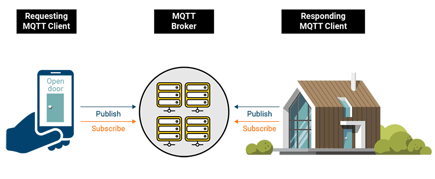

# MQTT

<figure><figcaption>
MQTT - Publish / Subscribe
</figcaption></figure>

> **Note:** **Message Queuing Telemetry Transport**
>
> MQTT is a standard messaging protocol used for the Internet of Things (IoT) because it requires minimal resources and can be executed by small microcontrollers found in connected devices.
>
> IoT devices have a real need for this type of lightweight protocol because it guarantees fast and reliable communication with minimal hardware requirements, keeping power consumption and manufacturing costs low.
>
> IoT devices like smart temperature sensors regularly transmit information over the internet, but before you can deduce any meaningful information from that measurement, you need to store it in an adequate database. Smart sensor measurements are not complex, but they are highly dependent on the time constant — when the measurement was taken — and as a result, time-series databases, like InfluxDB, offer an efficient option to store and manipulate that kind of data.

MQTT works on a **publish/subscribe** model. Devices (publishers) send messages to a **topic** on a **broker**; any number of subscribers can register interest in that topic and receive messages in near real-time. PDI subscribes as a consumer through the **MQTT Consumer** step.

## MQTT essentials

A handful of protocol features shape how the workshops behave. You configure several of these directly on the MQTT Consumer/Producer steps in PDI.

::: tabs

### Quality of Service (QoS)

QoS is the delivery guarantee agreed between sender and receiver. There are three levels:

* **QoS 0 — at most once:** fire-and-forget. The message is sent once and may be lost. Lowest overhead; fine for high-frequency sensor data where the odd dropped reading doesn't matter.
* **QoS 1 — at least once:** the message is confirmed (`PUBACK`) and re-sent if needed, so it always arrives but may be **duplicated**. The most commonly used level.
* **QoS 2 — exactly once:** a four-step handshake guarantees a single delivery, at the cost of the most overhead and latency. Reserve it for messages where a duplicate would cause harm.

Pick the lowest level that satisfies the use case — higher QoS means more round-trips and resource use.

### Topics & wildcards

A **topic** is a hierarchical UTF-8 string with levels separated by `/`, e.g. `industrial/robot/sensor`. The broker accepts any valid topic on the fly — no need to create it first. Subscribers can use **wildcards** (subscribe only):

* `+` — single level: `industrial/+/sensor` matches `industrial/robot/sensor` and `industrial/arm/sensor`.
* `#` — multi level (last character only): `industrial/#` matches everything under `industrial/`.

**Best practices:** keep topics short and specific, use only ASCII, avoid spaces and a leading `/`, and don't subscribe a client to a broad `#` in production — let the broker (or PDI) handle the volume instead.

### Sessions

The **clean session** flag set on connect decides whether the broker keeps state for a client:

* **Clean session (true):** the broker discards subscriptions and queued messages on disconnect — a fresh start each connect.
* **Persistent session (false):** the broker stores the client's subscriptions and **queues QoS 1/2 messages while it is offline**, delivering them on reconnect. Essential for intermittently-connected devices.

### Retained messages

A message published with the **retained** flag is stored by the broker as the last-known value for that topic (one per topic). Any client that subscribes *later* immediately receives it — so a new subscriber learns the current state without waiting for the next publish. Ideal for status topics (e.g. `device/status` = `online`).

### Last Will & Testament (LWT)

A client can register a **will message** when it connects. If it disconnects ungracefully (crash, network drop, missed keep-alive), the broker publishes that message on its behalf — typically a `sensor gone` / `offline` notice on a status topic. Combined with a retained status topic, this keeps subscribers informed of device availability.

### Keep alive

On connect the client negotiates a **keep-alive** interval (seconds). If no other packet is sent within it, the client sends a `PINGREQ` and the broker replies `PINGRESP`, so both sides can detect a dead ("half-open") connection. If the broker hears nothing within 1.5× the interval, it drops the client and fires its LWT.

:::

This module has two hands-on workshops:

* **HiveMQ** — consume industrial robot-sensor telemetry from a HiveMQ broker.
* **EMQX** — consume delivery-truck telemetry from an EMQX broker for a predictive-maintenance use case.
