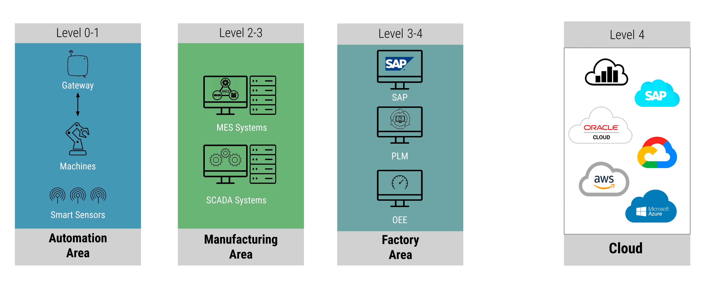
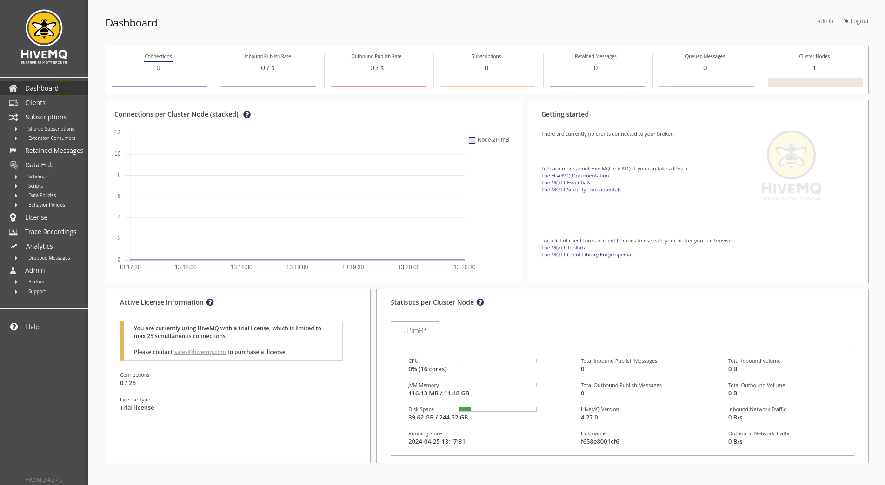
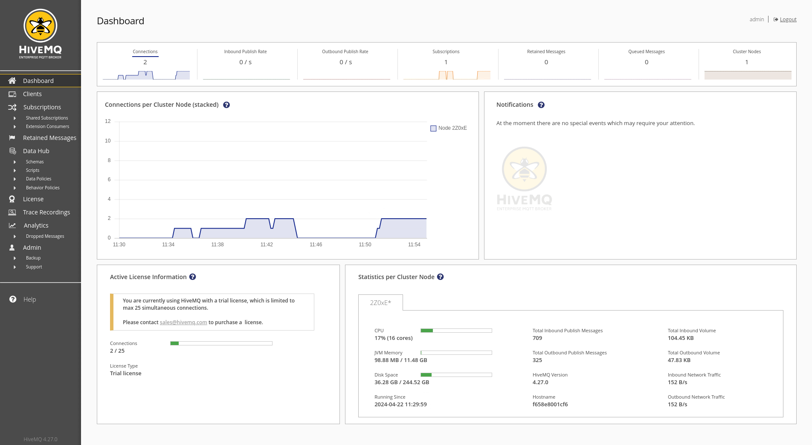
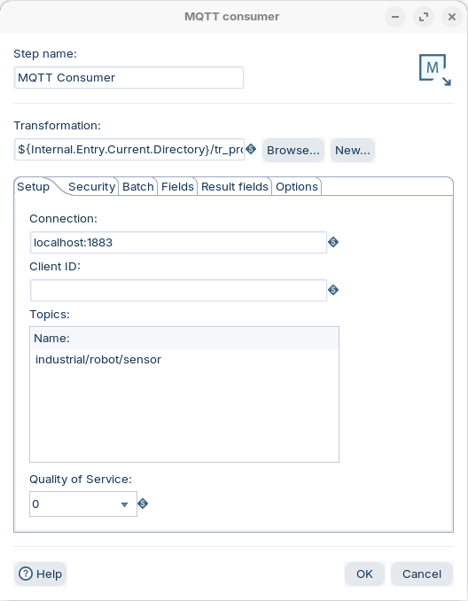
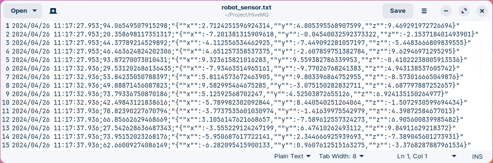

# HiveMQ (industrial robot sensors)

> **Warning:**
>
> #### Workshop - HiveMQ (industrial robot sensors)
>
> Plants use a wide selection of industrial sensors, each with a unique design and application to collect and analyze data. These **Supervisory Control and Data Acquisition (SCADA)** systems combine software and hardware to gather data from industrial equipment, and the majority of SCADA and MES systems support MQTT — making it the natural ingestion protocol for a Unified Namespace (UNS). Pentaho Data Integration enables you to collect data from any source in real-time, augment data streams in a single interface, and transform raw data into actionable manufacturing insights.
>
> In this workshop, you stand up a HiveMQ MQTT broker, publish simulated industrial robot-sensor telemetry to it, and consume the live stream in PDI using the MQTT Consumer parent/child pattern.
>
> **What you'll do**
>
> * Install and run a HiveMQ broker in Docker and log into its Control Center
> * Publish simulated robot-sensor readings to the `industrial/robot/sensor` topic with a Python script
> * Consume the stream in PDI with an MQTT Consumer parent transformation that calls a child per batch
> * Parse, timestamp, and append each sensor reading to an output file
> * Demonstrate the MQTT Last Will & Testament (LWT) pattern for device presence
>
> **Prerequisites:** Docker installed and running, Pentaho Data Integration (Spoon) available, and an understanding of basic transformation concepts (steps, hops, preview). Stop the Mosquitto broker first so it does not hold port 1883.
>
> **Estimated time:** 40 minutes

<figure><figcaption><p>SCADA</p></figcaption></figure>

> **Note:** A couple of the challenges that face implementing a SCADA system:
>
> * **Data Silos:** Brownfield factories have manufacturing equipment and backend systems from many vendors that produce data in proprietary formats. These formats often create data silos that hinder deep analysis across the entire factory operation.
> * **IT/OT Priorities:** A successful modernization project needs experts from both the operations side (OT) and the enterprise IT side (IT).

## Install and run HiveMQ

> **Danger:** Remember to stop the Mosquitto container first so it does not hold port 1883.

1. Ensure the Mosquitto broker has been stopped.

```bash
docker stop mosquitto
```

2. Copy over the required files.

```bash
cd
mkdir -p ~/Streaming/HiveMQ4 && cd "$_"
cp -R ~/Workshop--Data-Integration/Labs/'Module 7 - Workflows'/'Streaming Data'/HiveMQ/* .
```

3. Create an isolated Docker network so this workshop's containers don't clash with the others.

```bash
docker network create -d bridge hivemq
```

> **Note:** This HiveMQ deployment is **not** secure — it lacks authentication and authorization, so any MQTT client can connect with full permissions. For production, add a security extension and remove the `hivemq-allow-all` extension (see the HiveMQ Marketplace).

4. Run the HiveMQ Docker container.

```bash
docker run --ulimit nofile=500000:500000 --name=hivemq4 -p 9090:8080 -p 9000:9000 -p 1883:1883 --net=hivemq hivemq/hivemq4
```

| Flag | Description |
| --- | --- |
| `--ulimit` | Limits the system resource amounts that individual users can consume |
| `nofile` | The maximum number of open files / file descriptors a user can have at once |
| `--name` | Name of the container |
| `-p 9090` | Exposes the HiveMQ Control Center (container port 8080) on host port 9090 |
| `-p 9000` | Exposes the HiveMQ Websocket on port 9000 |
| `-p 1883` | Exposes the HiveMQ TCP listener on port 1883 |
| `--net` | Name of the isolated Docker network: `hivemq` |
| `hivemq/hivemq4` | Docker Hub image |

5. Log into the HiveMQ Control Center at `http://localhost:9090`.

| | |
| --- | --- |
| User | `admin` |
| Password | `hivemq` |

<figure><figcaption><p>HiveMQ Control Center</p></figcaption></figure>

## Generate robot-sensor data

Publish simulated industrial robot-sensor readings to the broker. The `sensor.py` script publishes a JSON message (temperature plus an x/y/z position) to the `industrial/robot/sensor` topic once per second.

> **Warning:** [Release 2.0.0](https://github.com/eclipse/paho.mqtt.python/releases/tag/v2.0.0) of the Paho Python MQTT client (11 Feb 2024) includes breaking changes. The script below sets `callback_api_version=VERSION1` to stay compatible.

1. Review the publisher script.

```bash
cd
cd ~/Streaming/HiveMQ4/scripts
cat sensor.py
```

```python
# python 3.10
# Note: requires the 'paho-mqtt' package.
# pip3 install "paho-mqtt<2.0.0" for V1

import random
import time
import json
from paho.mqtt import client as mqtt_client

broker = 'localhost'
port = 1883
topic = "industrial/robot/sensor"
status_topic = "industrial/robot/status"
client_id = f'python-mqtt-{random.randint(0, 1000)}'

def connect_mqtt():
    def on_connect(client, userdata, flags, rc):
        if rc == 0:
            print("Connected to MQTT Broker!")
            # Announce we're alive. Retained, so a subscriber that connects
            # later still sees the current status.
            client.publish(status_topic, "online", qos=1, retain=True)
        else:
            print("Failed to connect, return code %d\n", rc)
    client = mqtt_client.Client(client_id=client_id, callback_api_version=mqtt_client.CallbackAPIVersion.VERSION1)
    # Last Will & Testament: the broker publishes this for us if we drop
    # unexpectedly (crash, network loss, missed keep-alive).
    client.will_set(status_topic, "offline", qos=1, retain=True)
    client.on_connect = on_connect
    client.connect(broker, port)
    return client

def publish(client):
    while True:
        temperature = random.uniform(20.0, 100.0)
        position = {'x': random.uniform(-10.0, 10.0), 'y': random.uniform(-10.0, 10.0), 'z': random.uniform(-10.0, 10.0)}
        message = json.dumps({'temperature': temperature, 'position': position})
        result = client.publish(topic, message)
        if result[0] == 0:
            print(f"Sent `{message}` to topic `{topic}`")
        else:
            print(f"Failed to send message to topic {topic}")
        time.sleep(1)

def run():
    client = connect_mqtt()
    client.loop_start()
    publish(client)

if __name__ == '__main__':
    run()
```

2. Execute the publisher.

```bash
cd
cd ~/Streaming/HiveMQ4/scripts
python3 sensor.py
```

3. In the HiveMQ Control Center, confirm the inbound connection and message rate.

<figure><figcaption><p>HiveMQ - Dashboard</p></figcaption></figure>

> **Note:** `CTRL + Z` will stop the Python script.

## Consume the stream in PDI

Subscribe to the `industrial/robot/sensor` topic and process the data with PDI's parent/child pattern.

1. Start Pentaho Data Integration.

```bash
cd
cd Pentaho/design-tools/data-integration
./spoon.sh
```

2. With `sensor.py` still publishing, open the **parent** transformation:

```
~/Streaming/HiveMQ4/tr_hive_consumer.ktr
```

3. Double-click the **MQTT Consumer** step. It runs a child transformation per batch:

```
${Internal.Entry.Current.Directory}/tr_process_sensor_data.ktr
```

<figure><figcaption><p>MQTT Consumer - industrial/robot/sensor</p></figcaption></figure>

> **Note:** **Reference — connection settings**
>
> On the MQTT Consumer step you also set the connection options described on this module's **Overview** page:
>
> * **Topic:** `industrial/robot/sensor` (the topic the sensor publishes to). A `+`/`#` wildcard would let one consumer cover several sensors.
> * **QoS:** `0` is fine for this high-frequency sensor feed — an occasional dropped reading is harmless. Use `1` if every reading must arrive.
> * **Keep alive / clean session:** leave the defaults; a clean session is fine here since the workshop processes the live stream rather than replaying a backlog.

4. Open the **child** transformation:

```
~/Streaming/HiveMQ4/tr_process_sensor_data.ktr
```

It begins with **Get records from stream**, then a **JSON Input** step parses each `message`.

> **Note:** The child transformation:
>
> * pulls the `message` records from the stream
> * adds a timestamp
> * reads the JSON stream
> * appends to a file in the `Project/HiveMQ` directory

5. Open the output file and confirm rows are being appended.

```
~/Streaming/HiveMQ4/output/robot_sensor.txt
```

<figure><figcaption><p>robot_sensor</p></figcaption></figure>

## Last Will & Testament (LWT)

The updated `sensor.py` does two extra things on top of streaming readings:

* On connect it publishes a **retained** `online` message to `industrial/robot/status`.
* It registers a **will**: `industrial/robot/status` = `offline` (retained). The broker publishes this *for* the sensor if it drops unexpectedly.

Together these let any subscriber — even one that connects long after the sensor — know whether the robot is alive. This is the standard MQTT pattern for device presence (see the **Overview** page for the concept).

1. Subscribe to the status topic to watch it. Use **MQTT Explorer** (or the HiveMQ websocket client), connect to `localhost:1883`, and subscribe to:

```
industrial/robot/status
```

With `sensor.py` running you receive `online` immediately — because the message is **retained**, the broker replays the last value to new subscribers.

2. Now stop the sensor **ungracefully** — close its terminal, or kill the process so it never sends a clean DISCONNECT:

```bash
pkill -f sensor.py
```

3. Wait for the keep-alive interval to elapse (paho's default is 60 s, so allow up to ~90 s). The broker detects the dropped client and publishes the will — watch `industrial/robot/status` flip to `offline`.

> **Note:** A **graceful** disconnect (the client calling `disconnect()`) tells the broker to discard the will, so it is **not** sent. The will fires only on an unexpected drop — a crash, network loss, or missed keep-alive — which is exactly when you want to be told a device went away. Re-running `sensor.py` republishes the retained `online`, clearing the state.
