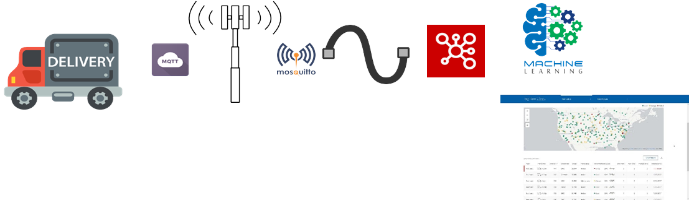
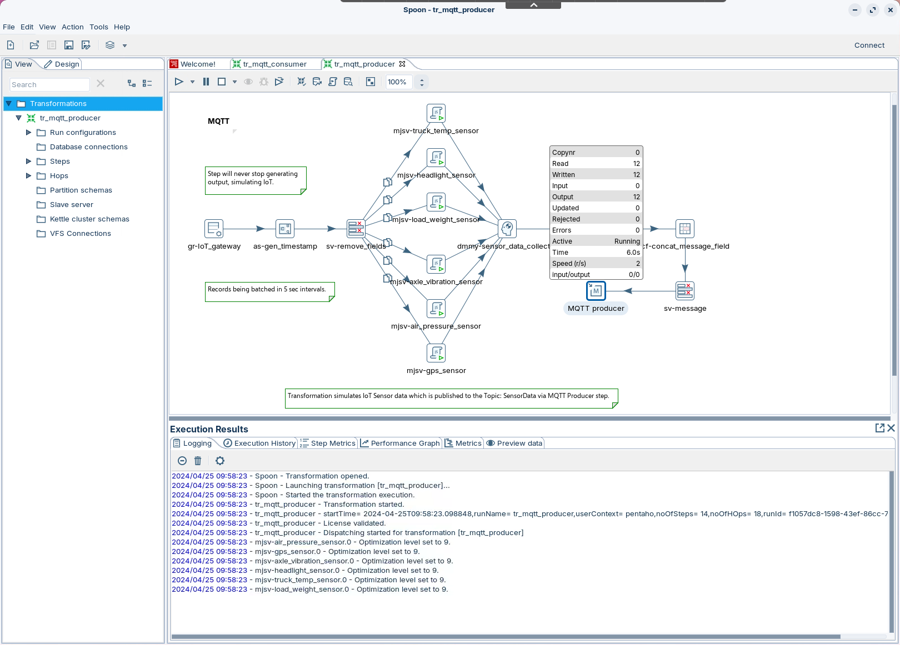
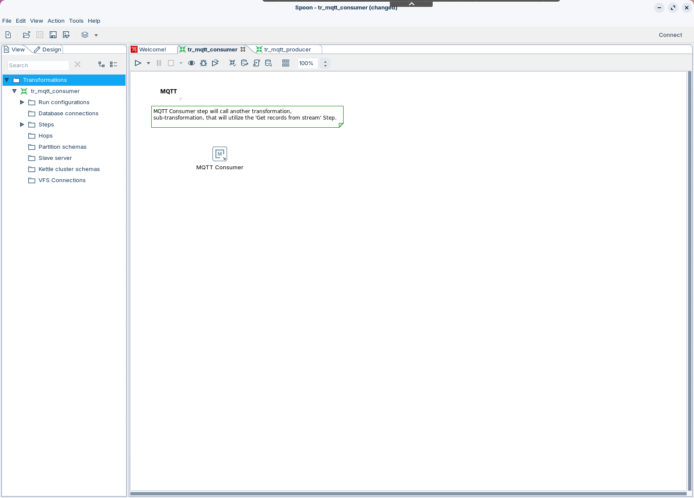
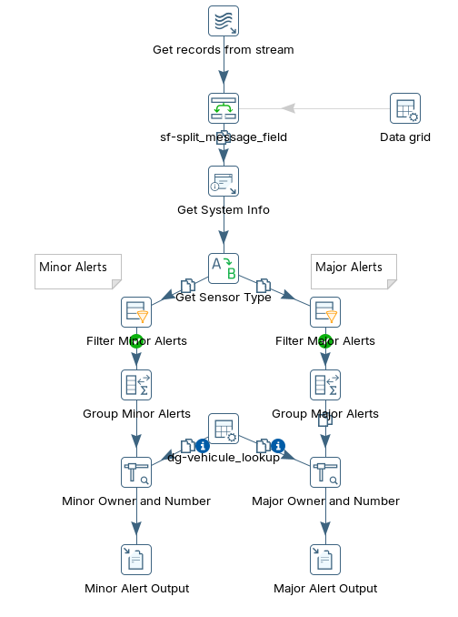
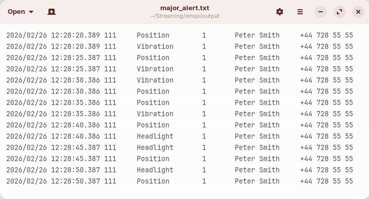

# EMQX (delivery-truck telemetry)

> **Warning:**
>
> #### Workshop - EMQX (delivery-truck telemetry)
>
> A predictive-maintenance logistics use case: you want near-real-time telemetry from delivery trucks. Each truck publishes sensor telemetry to an MQTT topic over GSM. **EMQX** is the MQTT broker, and **Pentaho Data Integration (PDI)** subscribes and processes the messages.
>
> In this workshop, you publish telemetry into EMQX with a producer transformation, consume it in PDI with a consumer plus child transformation, and write minor and major alerts to output files.
>
> **What you'll do**
>
> * Publish delivery-truck telemetry to an EMQX MQTT topic with the **MQTT Producer** step
> * Subscribe to the topic in PDI with the **MQTT Consumer** step
> * Process streamed messages in a child transformation
> * Filter and aggregate minor and major alerts
> * Append the results to output files
>
> **Prerequisites:** EMQX running and reachable — MQTT broker (TCP) at `localhost:1883` and the EMQX Dashboard at `http://localhost:18083` (default credentials are often `admin` / `Password123`; see the EMQX setup guide if you need to set it up first). The lab files must exist: `~/Streaming/emqx/solution/tr_mqtt_producer.ktr`, `~/Streaming/emqx/solution/tr_mqtt_consumer.ktr`, and `~/Streaming/emqx/solution/tr_process_sensor_data.ktr`.
>
> **Estimated time:** 35 minutes

<figure><figcaption><p>Logistics</p></figcaption></figure>

## Publish telemetry to EMQX

1. Launch Pentaho Data Integration.

::: tabs

### macOS / Linux

```bash
cd
cd ~/Pentaho/design-tools/data-integration
./spoon.sh
```

### Windows

```powershell
cd \
cd Pentaho/design-tools/data-integration
.\spoon.bat
```

:::

2. Open the producer transformation:

```
~/Streaming/emqx/solution/tr_mqtt_producer.ktr
```

<figure><figcaption><p>MQTT Producer</p></figcaption></figure>

This transformation generates data for `vehicle_id = 111` every 5 seconds, adds a timestamp, builds a `message` payload, and publishes it to EMQX using the **MQTT Producer** step.

3. Double-click **MQTT Producer** and confirm these settings:

* **Connection:** points to your broker (for example `tcp://localhost:1883`)
* **Client ID:** unique on the broker
* **Topic:** note the value — you reuse it in the consumer
* **QoS:** choose based on delivery requirements
* **Message field:** `message`

4. Run the transformation, then validate in the EMQX Dashboard (`http://localhost:18083`): under **Clients** confirm the producer is connected, and under **Topics** confirm the message rate.

> **Note:** **Reference — QoS and session settings**
>
> **QoS:** `0` (at most once) lowest latency, messages can be lost; `1` (at least once) can deliver duplicates; `2` (exactly once) highest overhead.
>
> **Clean session:** `True` — broker does not persist state for this client; `False` — broker persists subscriptions and queued QoS 1/2 messages.

## Consume and process telemetry

1. Open the consumer transformation:

```
~/Streaming/emqx/solution/tr_mqtt_consumer.ktr
```

<figure><figcaption><p>MQTT Consumer</p></figcaption></figure>

2. Double-click **MQTT Consumer** and confirm:

* **Topic** matches the producer topic.
* **Child transformation** points to:

```
${Internal.Entry.Current.Directory}/tr_process_sensor_data.ktr
```

* **Batch** has at least one trigger set: **Duration (ms)** `> 0`, or **Number of records** `> 0`.

3. Run the transformation, then validate in the EMQX Dashboard: under **Clients** confirm the consumer is connected, and under **Subscriptions** confirm it is subscribed to the topic.

> **Note:** **Reference — batch and backpressure**
>
> PDI runs the child transformation when either threshold is met: **Duration (ms)** (time window) or **Number of records** (message count). Backpressure controls: **Message prefetch limit** (max messages PDI queues in memory) and **Maximum concurrent batches** (increases throughput and resource use).

## Inspect results

1. Open the child transformation:

```
~/Streaming/emqx/solution/tr_process_sensor_data.ktr
```

<figure><figcaption><p>Process sensor data</p></figcaption></figure>

This transformation pulls `message` records from the stream, adds a timestamp, resolves `sensor_type`, filters minor and major alerts, aggregates alerts for reporting, and appends results to output files.

2. Open the output files and confirm new rows append:

* `~/Streaming/emqx/output/major_alert.txt`
* `~/Streaming/emqx/output/minor_alert.txt`

<figure><figcaption><p>major_alert</p></figcaption></figure>

> **Warning:** If you see no output, check these first:
>
> * the producer and consumer use the same **topic**
> * EMQX shows both clients as **connected**
> * the consumer batch has **Duration (ms)** or **Number of records** set to `> 0`
> * the child transformation starts with **Get records from stream**
