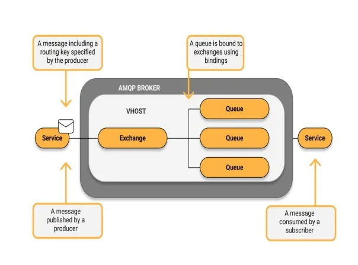
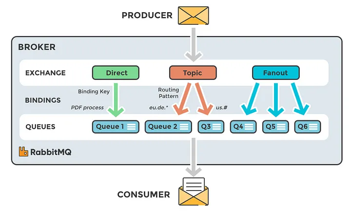
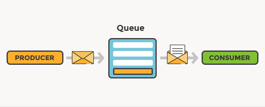

# AMQP

<figure><figcaption>
AMQP Model
</figcaption></figure>

> **Note:** **Advanced Message Queuing Protocol**
>
> AMQP brokers facilitate high-performance, reliable, and scalable messaging services between applications. This makes them ideal for scenarios needing:
>
> * **Asynchronous Communication:** decoupling producers and consumers so they communicate without waiting for responses, enhancing responsiveness.
> * **System Decoupling:** applications communicate through messages rather than direct method calls, improving modularity and scalability.
> * **Resilience and Fault Tolerance:** messages can be queued, ensuring no loss of information on temporary failures.
> * **Load Balancing:** efficient distribution of message processing across multiple consumer instances.
> * **Distributed Systems Communication:** a unified messaging platform for microservices and distributed architectures.
>
> AMQP brokers, such as RabbitMQ, offer a standardized, open solution to these requirements, making them a cornerstone of modern distributed application architectures.

## AMQP concepts

::: tabs

### Exchanges

Messages are not published directly to a queue; instead, the producer sends messages to an **exchange**. An exchange routes messages to queues with the help of **bindings** and **routing keys**.

* A **binding** is a link between a queue and an exchange.
* The **routing key** is a message attribute the exchange looks at when deciding how to route the message (depending on exchange type).

Exchanges, connections, and queues can be configured as *durable* (survive a restart), *temporary* (last until the broker is shut down), or *auto-delete* (removed once the last bound object is unbound). RabbitMQ provides four exchange types; the default is **fanout**, which broadcasts every message it receives to all bound queues, ignoring routing keys.

<figure><figcaption>
Exchanges
</figcaption></figure>

### Queues

In RabbitMQ, **queues** are the central structures where messages are stored for a consuming application to process. Messages flow into the queue from producers and wait there until a consumer retrieves them, allowing asynchronous communication and workload decoupling.

Queues have several important characteristics:

* **Durability:** durable queues are saved to disk and survive broker restarts; transient queues do not.
* **Exclusivity:** an exclusive queue is used by only one connection and is deleted when that connection closes.
* **Auto-delete:** an auto-delete queue deletes itself when its consumer count drops to zero.

Messages are typically consumed FIFO (first in, first out), though RabbitMQ supports other dispatching strategies.

<figure><figcaption>
Queues
</figcaption></figure>

:::

This module has one hands-on workshop:

* **RabbitMQ** — consume room-sensor data from a RabbitMQ broker and append it to output files.
