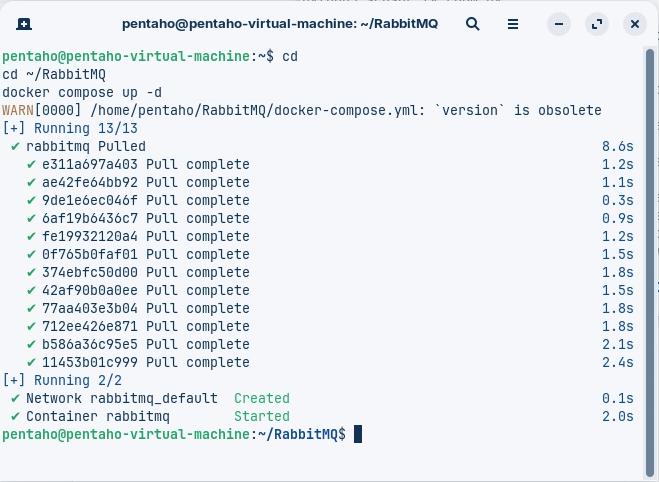
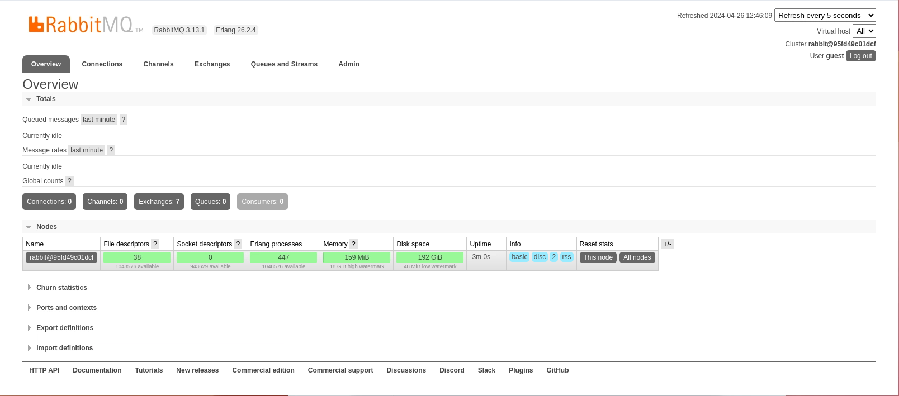
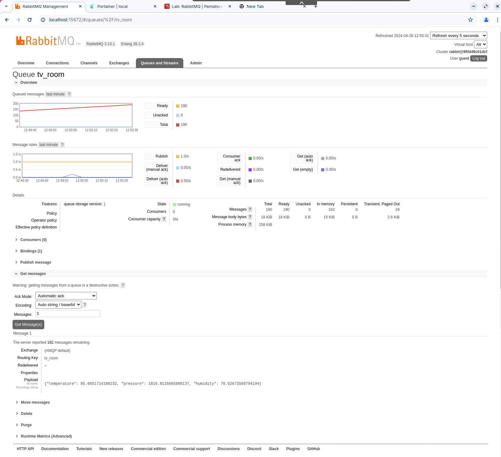
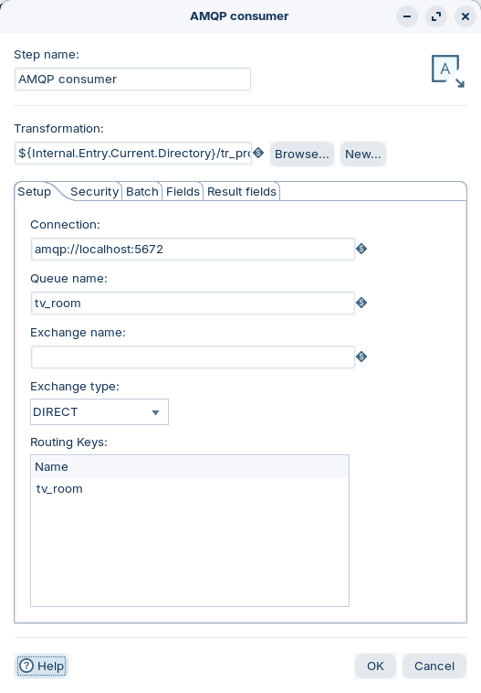
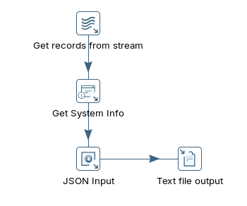
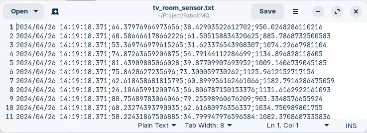

# RabbitMQ (room sensors)

> **Warning:**
>
> #### Workshop - RabbitMQ (room sensors)
>
> RabbitMQ is a popular open-source message broker that enables complex routing, message queuing, and message distribution. It supports multiple messaging protocols, most notably AMQP, and is designed to handle high volumes of messages asynchronously.
>
> In this workshop, you assume a house with a sensor in each room continuously monitoring **temperature**, **pressure**, and **humidity**, and consume that stream in PDI. One of RabbitMQ's main features is the ability to route messages to specific queues based on a routing key.
>
> **What you'll do**
>
> * Deploy and run RabbitMQ in a Docker container
> * Publish simulated room-sensor readings with a Python AMQP script
> * Consume the `tv_room` queue in PDI with the AMQP Consumer step
> * Process the stream with the parent/child transformation pattern
> * Append the parsed sensor data to an output file
>
> **Prerequisites:** Docker, the [**pika**](https://pypi.org/project/pika/) Python AMQP client library, and a working Pentaho Data Integration (Spoon) install.
>
> **Estimated time:** 30 minutes

## Install and run RabbitMQ

1. Deploy the `rabbitmq` container.

```bash
cd
cd ~/RabbitMQ
docker compose up -d
```

<figure><figcaption><p>Deploy RabbitMQ container</p></figcaption></figure>

2. Log into RabbitMQ at `http://localhost:15672`.

| | |
| --- | --- |
| Username | `guest` |
| Password | `guest` |

<figure><figcaption><p>RabbitMQ UI</p></figcaption></figure>

## Publish sensor data

Publish simulated room-sensor readings to the broker. The `sensor_tv_room.py` script publishes a JSON message (temperature, pressure, humidity) to the `tv_room` queue once per second.

> **Warning:** Ensure you have installed the [**pika**](https://pypi.org/project/pika/) Python AMQP client library before running the script.

1. Review the publisher script.

```python
import pika
import random
import time
import json

rabbitmq_host = 'localhost'
port = 5672
queue_name = 'tv_room'

def generate_sensor_data():
    return {
        'temperature': random.uniform(20.0, 100.0),
        'pressure': random.uniform(800.0, 1200.0),
        'humidity': random.uniform(30.0, 80.0)
    }

def publish_sensor_data():
    connection = pika.BlockingConnection(pika.ConnectionParameters(host=rabbitmq_host, port=port))
    channel = connection.channel()
    channel.queue_declare(queue=queue_name)
    while True:
        sensor_data = generate_sensor_data()
        message = json.dumps(sensor_data)
        channel.basic_publish(exchange='', routing_key=queue_name, body=message)
        print(f"Sent sensor data: {message}")
        time.sleep(1)
    connection.close()

if __name__ == '__main__':
    publish_sensor_data()
```

2. Execute the publisher.

```bash
cd
cd ~/Workshop--Data-Integration/Labs/'Module 3 - Data Sources'/'Streaming Data'/'03 RabbitMQ'
python3 sensor_tv_room.py
```

3. In the RabbitMQ UI, click **Queues & Streams** and confirm the `tv_room` queue is receiving messages. To inspect one, use **Get message** with **Ack Mode: Automatic ack**.

<figure><figcaption><p>RabbitMQ - tv_room queue</p></figcaption></figure>

## Consume the stream in PDI

Subscribe to the `tv_room` queue and process the data with PDI's parent/child pattern.

1. Start Pentaho Data Integration.

```bash
cd
cd Pentaho/design-tools/data-integration
sh spoon.sh
```

2. With the publisher still running, open the **parent** transformation:

```
~/Workshop--Data-Integration/Labs/Module 3 - Data Sources/Streaming Data/03 RabbitMQ/tr_amqp_consumer.ktr
```

3. Double-click the **AMQP Consumer** step.

<figure><figcaption><p>AMQP Consumer</p></figcaption></figure>

> **Note:** The **AMQP Consumer** step receives streaming data from an AMQP producer through an AMQP 0-9-1 compatible broker. It can use an existing queue or create a new one. The parent step runs a child transformation that executes according to the message batch size or duration. As a best practice, always run the AMQP Consumer step first — to initialize the broker bindings — before producing messages.

| Option | Description |
| --- | --- |
| Connection | The URI address of the AMQP broker this step connects to (see the RabbitMQ URI spec). |
| Queue name | The AMQP queue to ingest from. A new queue is created on first run, defaulting to durable, non auto-delete, non-exclusive. If a queue of that name exists with different settings, the transformation aborts. |
| Exchange name | A new or existing exchange to bind the queue. Leave blank to use the DEFAULT exchange with type DIRECT. |
| Routing Keys | When the exchange type is DIRECT or TOPIC, specify one or more routing keys as string names. |

4. Open the **child** transformation:

```
~/Workshop--Data-Integration/Labs/Module 3 - Data Sources/Streaming Data/03 RabbitMQ/tr_process_sensor_data.ktr
```

It begins with **Get records from stream**, then a **JSON Input** step parses each `message`.

<figure><figcaption><p>tr_process_sensor_data</p></figcaption></figure>

> **Note:** The child transformation:
>
> * pulls the `message` records from the stream
> * adds a timestamp
> * reads the JSON stream
> * appends to a file in the `Project/RabbitMQ` directory

5. Open the output file and confirm rows are being appended.

```
~/Project/RabbitMQ/tv_room_sensor.txt
```

<figure><figcaption><p>tv_room_sensor</p></figcaption></figure>
