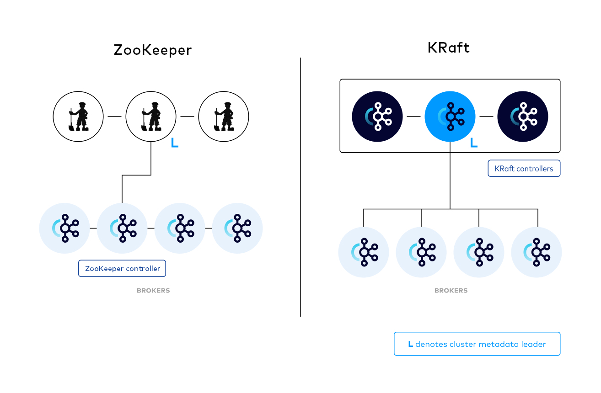
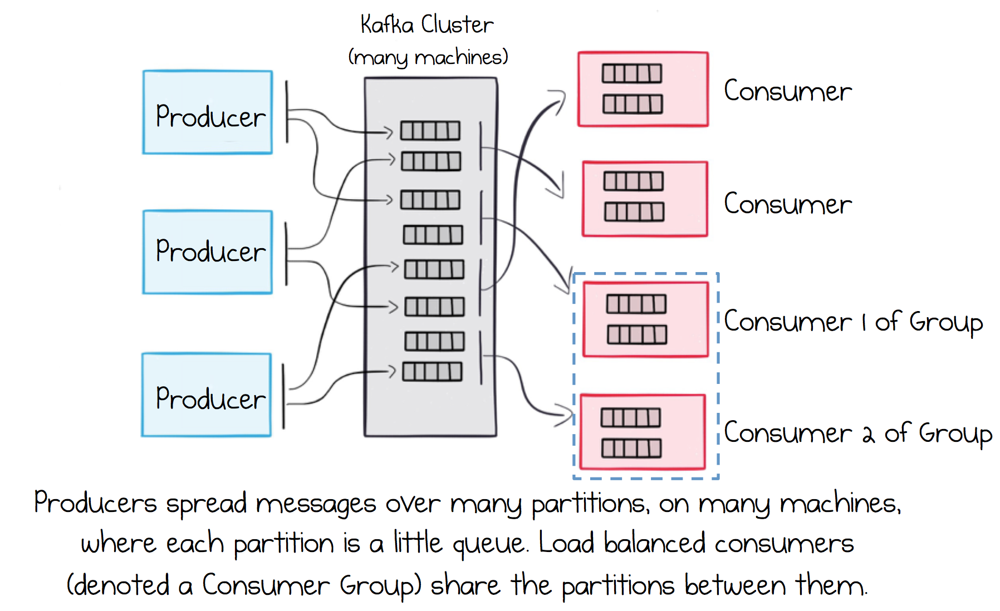

# Kafka

<figure><figcaption>
Kafka Architecture
</figcaption></figure>

> **Note:** **Apache Kafka**
>
> Apache Kafka is a distributed streaming platform that enables users to publish, subscribe to, store, and process streams of records in real time. It is designed to handle high volumes of data efficiently, making it an excellent choice for large-scale message processing tasks. Kafka is built around the concept of a distributed commit log, providing fault tolerance, durability, and high throughput for both publishing and subscribing by leveraging cluster nodes.
>
> It supports producers sending messages to topics, from which consumers can read and process these messages. This makes Kafka suitable for a variety of applications, including real-time analytics, event sourcing, log aggregation, and more.

> **Note:** Apache Kafka in **KRaft (Kafka Raft metadata) mode** simplifies Kafka's operational model by eliminating the need for an external ZooKeeper cluster. Below are the key components of a Kafka cluster running in KRaft mode.

::: tabs

### Controller

Manages the state of the cluster and is responsible for administrative tasks such as topic creation, deletion, and partition reassignment. In KRaft mode, the controller logic is embedded within the Kafka broker itself, leveraging the Raft protocol for consensus.

### Broker

A server in the Kafka cluster that stores data and serves client requests. In KRaft mode, brokers can handle both standard client requests and participate in cluster management operations.

<figure><figcaption>
Kafka Cluster
</figcaption></figure>

### KRaft Mode

Kafka KRaft is Apache Kafka's controller architecture that eliminates the dependency on Apache ZooKeeper. It consolidates metadata management within Kafka itself, replacing the traditional ZooKeeper-based controller. This simplifies deployment and operations by reducing the number of components to maintain, improves scalability by removing ZooKeeper bottlenecks, and enhances performance through optimized metadata handling.

### Schema Registry

Schema Registry provides a centralized repository for managing and validating schemas for topic message data, and for serialization and deserialization of the data over the network. It is not part of Apache Kafka itself, but there are several open-source options to choose from. It lives separately from your brokers; producers and consumers talk to Kafka to publish and read messages, and concurrently talk to Schema Registry to send and retrieve the schemas that describe those messages.

:::

This module has one hands-on workshop:

* **Use Cases** — consume a real-time user-activity stream from Kafka and load it into a MySQL warehouse.
