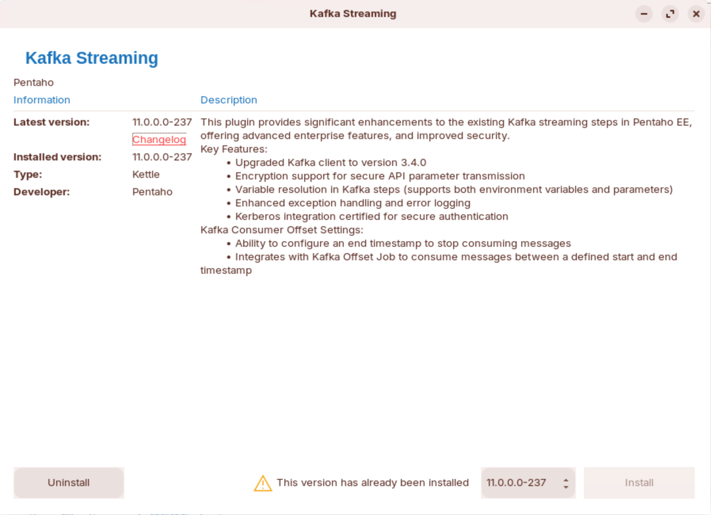
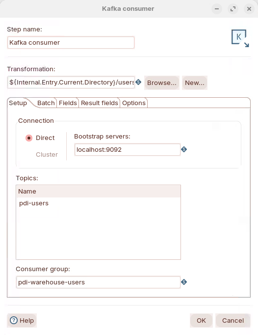
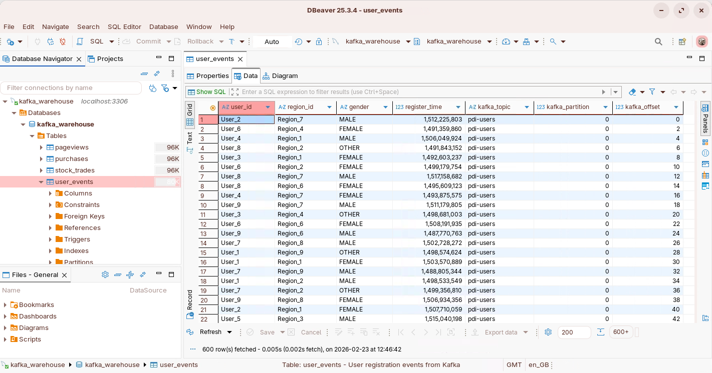

# Use Cases — Real-time user-activity stream

> **Warning:**
>
> #### Workshop - Use Cases — Real-time user-activity stream
>
> Your company tracks user registrations across web and mobile platforms. User-registration events are published to a Kafka topic in real-time. This workshop uses the Pentaho Data Integration (PDI) Kafka Enterprise Edition plugin and the parent/child transformation pattern to consume those events continuously.
>
> In this workshop, you build a streaming pipeline that continuously reads these events, parses the JSON payload, transforms timestamps, and loads the data into a MySQL data warehouse — enabling real-time dashboards and analytics.
>
> **What you'll do**
>
> * Install and verify the Kafka EE plugin in Spoon
> * Configure the **Kafka Consumer** step in a parent transformation to read `pdi-users` in batches
> * Parse the JSON payload and set field metadata in the child transformation
> * Convert epoch-millisecond timestamps to seconds with a **Formula** step
> * Write the stream into a MySQL `user_events` table with **Table output**
> * Run the pipeline end-to-end and verify the loaded data
>
> **Prerequisites:** Pentaho Data Integration installed, a running Kafka cluster, and a MySQL database. Familiarity with basic transformation concepts (steps, hops, preview).
>
> **Estimated time:** 45 minutes

1. Ensure the Kafka EE plugin is installed.

<figure><figcaption><p>Kafka EE plugin</p></figcaption></figure>

2. Start Pentaho Data Integration.

```bash
cd
cd Pentaho/design-tools/data-integration
sh spoon.sh
```

> **Note:** **Architecture overview** — this workshop uses PDI's parent/child transformation pattern:
>
> ```
> ┌──────────────────────────────────────────────┐
> │  PARENT TRANSFORMATION (users-to-db-parent)  │
> │  ┌────────────────────────┐                  │
> │  │    Kafka Consumer      │                  │
> │  │    Topic: pdi-users    │                  │
> │  │    Batch: 5s / 100 rec │──── batches ───► │
> │  └────────────────────────┘                  │
> └──────────────────────────────────────────────┘
>                     │
>                     ▼
> ┌──────────────────────────────────────────────┐
> │  CHILD TRANSFORMATION (users-to-db-child)    │
> │  Get records from stream                     │
> │  JSON Input (parse $.userid, $.regionid,     │
> │              $.gender, $.registertime)       │
> │  Select values (rename + set metadata)       │
> │  Formula (epoch ms ÷ 1000 → seconds)         │
> │  Table output (→ user_events)                │
> └──────────────────────────────────────────────┘
> ```
>
> The parent's Kafka Consumer reads messages in batches (every 5 seconds or 100 records, whichever comes first) and passes each batch to the child, which parses, transforms, and writes it to MySQL.

#### Lab Files

Everything this workshop runs ships with the lab. One-time: copy the
files out of the guide's content folder and install the publisher's
Python dependency:

**Windows (PowerShell)**

```powershell
Copy-Item "$env:APPDATA\com.pentaho.content-manager\content\08-kafka-use-cases\files" "$env:USERPROFILE\kafka-lab" -Recurse
cd $env:USERPROFILE\kafka-lab
pip install -r requirements.txt
```

**macOS / Linux**

```bash
cp -r ~/.local/share/com.pentaho.content-manager/content/08-kafka-use-cases/files ~/kafka-lab
cd ~/kafka-lab && pip3 install -r requirements.txt
```

[produce_users.py](./files/produce_users.py) [requirements.txt](./files/requirements.txt) [01-create-kafka-warehouse.sql](./files/01-create-kafka-warehouse.sql)

[users-to-db-parent.ktr](./files/users-to-db-parent.ktr) <button data-launch="spoon" data-path="files/users-to-db-parent.ktr">Open in Pentaho Data Integration</button> <button data-graph="files/users-to-db-parent.ktr">View graph</button>

[users-to-db-child.ktr](./files/users-to-db-child.ktr) <button data-launch="spoon" data-path="files/users-to-db-child.ktr">Open in Pentaho Data Integration</button> <button data-graph="files/users-to-db-child.ktr">View graph</button>

***

## Configure the Kafka Consumer

1. Open the parent transformation:

```
~/kafka-lab/users-to-db-parent.ktr   (or use the Open in Pentaho Data Integration button in Lab Files)
```

2. Double-click the **Kafka Consumer** step and review the properties across its tabs.

::: tabs

### Setup

<figure><figcaption><p>Setup</p></figcaption></figure>

| Property | Description | Value |
| --- | --- | --- |
| Transformation | Child transformation to process the records | `${Internal.Entry.Current.Directory}/users-to-db-child.ktr` |
| Connection | Direct: specify bootstrap servers. Cluster: specify a Hadoop cluster configuration. | `127.0.0.1:9092` |
| Topics | Kafka topics to consume from | `pdi-users` |
| Consumer Group | Each consumer step starts a single thread. As part of a group, each consumer is assigned a subset of topic partitions. | `pdi-warehouse-users` |

### Batch

> **Note:** **How batching works** — whichever threshold is reached first (duration or record count) triggers the batch to be sent to the child. With `pdi-users` producing ~1 msg/sec, the 5-second duration usually triggers first, sending ~5 records per batch.

| Property | Description | Value |
| --- | --- | --- |
| Duration (ms) | Time to collect records before executing the child transformation. | `500` |
| Number of records | Number of records to collect before executing the child. | `100` |
| Maximum concurrent batches | Maximum number of batches to collect at the same time. | `1` |
| Message prefetch limit | Limit for incoming messages to queue for processing. | `100000` |
| Offset Management | `Commit when record read` vs `Commit when batch completed`. | `Commit when batch completed` |

### Fields

The default fields received from Kafka streams:

| Field | Description |
| --- | --- |
| `key` | Determines message distribution to partitions. If absent, messages are randomly distributed. |
| `message` | The message value. |
| `topic` | Topic name. |
| `partition` | Partition number. |
| `offset` | Sequential ID that uniquely identifies the record within the partition. |
| `timestamp` | Time the message is received on the server. |

### Options

| Property | Description | Value |
| --- | --- | --- |
| `auto.offset.reset` | Sets the offset from when to process records: `latest`, `earliest`. | `earliest` |

:::

## Process the stream in the child transformation

> **Note:** **Get records from stream** receives the batched records from `users-to-db-parent.ktr`. It produces rows and so must be the first step in the child transformation.

Open the child transformation:

```
~/kafka-lab/users-to-db-child.ktr
```

::: tabs

### 1. Get records from stream

Double-click the step and enter the expected stream fieldnames and types — these match the fields surfaced by the parent's Kafka Consumer.

### 2. JSON Input

Parse the `message` value with the **JSON Input** step.

1. On the **File** tab, enable **Source is from previous step** and select the `message` field.
2. On the **Content** tab, suppress errors.
3. On the **Fields** tab, manually enter the JSONPath for each field.

**Sample message:**

```json
{"registertime":1493899960000,"userid":"User_1","regionid":"Region_9","gender":"MALE"}
```

| JSON Field | Type | Description |
| --- | --- | --- |
| `registertime` | Long | Registration timestamp (epoch milliseconds) |
| `userid` | String | User identifier (e.g. `User_1`) |
| `regionid` | String | Region identifier (e.g. `Region_9`) |
| `gender` | String | Gender (`MALE` or `FEMALE`) |

### 3. Select values

On the **Metadata** tab, set the data type and length for each field.

> **Warning:** This is **critical for MySQL** — without explicit lengths, PDI maps String fields to `TINYTEXT`, which breaks MySQL indexes with errors like `BLOB/TEXT column 'user_id' used in key specification without a key length`.

| Fieldname | Type | Length |
| --- | --- | --- |
| `user_id` | String | 100 |
| `region_id` | String | 100 |
| `gender` | String | 20 |
| `register_time_epoch` | Integer | 15 |
| `kafka_topic` | String | 255 |
| `kafka_partition` | Integer | 9 |
| `kafka_offset` | Integer | 15 |
| `key` | String | 100 |
| `message` | String | 5000 |
| `timestamp` | Integer | 15 |

### 4. Formula

Add a **Formula** step to convert the epoch-millisecond timestamp to seconds.

| New field | Formula | Value type |
| --- | --- | --- |
| `register_time_seconds` | `[register_time_epoch] / 1000` | Integer |

> **Note:** **Why Formula instead of Calculator?** The Calculator step requires both operands to be existing stream fields — you cannot enter a literal constant like `1000`. The Formula step supports inline constants. MySQL's `TIMESTAMP` column expects epoch seconds, so dividing the datagen's epoch-millisecond `registertime` by 1000 gives the right value.

### 5. Table output

First, create the MySQL connection in Spoon: **View** panel → right-click **Database connections** → **New**.

| Setting | Value |
| --- | --- |
| Connection Name | `warehouse_db` |
| Connection Type | MySQL |
| Access | Native (JDBC) |
| Host Name | `localhost` |
| Database Name | `kafka_warehouse` |
| Port Number | `3306` |
| User Name | `kafka_user` |
| Password | `kafka_password` |

Then configure the **Table output** step: connection `warehouse_db`, target table `user_events`, **leave Target schema blank**, commit size `1000`, **Specify database fields: Yes**.

> **Note:** **Leave Target schema blank** for MySQL — it uses the database name from the connection, not a separate schema. Setting it qualifies the table as `kafka_warehouse.user_events`, which can fail.

| Database Column | Stream Field |
| --- | --- |
| `user_id` | `user_id` |
| `region_id` | `region_id` |
| `gender` | `gender` |
| `register_time` | `register_time_seconds` |
| `kafka_topic` | `kafka_topic` |
| `kafka_partition` | `kafka_partition` |
| `kafka_offset` | `kafka_offset` |

> **Danger:** Do **not** map `event_id` (AUTO_INCREMENT primary key) or `ingestion_timestamp` (DEFAULT CURRENT_TIMESTAMP) — MySQL fills these automatically. If you click **SQL** and PDI suggests `ALTER TABLE ... MODIFY user_id TINYTEXT`, close without executing and fix the string lengths on the Select values **Metadata** tab.

:::

## Execute the pipeline

> **Warning:** **Prerequisites** — before running: the streaming services are up (`provisioning\setup-services.ps1 -Streaming` starts Kafka on `127.0.0.1:9092` alongside the brokers), the `kafka_warehouse` database exists (one-time SQL below), and the bundled `produce_users.py` publisher is feeding the topic.

1. One-time: create the `kafka_warehouse` database in the workshop MySQL (started by `setup-services`).

```bash
podman exec -i pcm-mysql mysql -uroot -ppassword < ~/kafka-lab/01-create-kafka-warehouse.sql
```

2. Start the publisher and keep it running — it plays the role of the original workshop's datagen connector, emitting the same `pdi-users` events.

```bash
cd ~/kafka-lab
python3 produce_users.py
```

3. Run `users-to-db-parent.ktr`. The user events are consumed and processed, writing the stream to the `user_events` table.

3. Verify the data in MySQL.

```bash
podman exec -it pcm-mysql mysql -ukafka_user -ppassword kafka_warehouse
```

```sql
-- Record count (should increase over time)
SELECT COUNT(*) FROM user_events;

-- Recent records
SELECT * FROM user_events ORDER BY ingestion_timestamp DESC LIMIT 10;

-- Duplicate check (should return 0 rows)
SELECT kafka_topic, kafka_partition, kafka_offset, COUNT(*)
FROM user_events
GROUP BY kafka_topic, kafka_partition, kafka_offset
HAVING COUNT(*) > 1;

-- Offset progress by partition
SELECT kafka_partition, MIN(kafka_offset) AS min_offset,
       MAX(kafka_offset) AS max_offset, COUNT(*) AS record_count
FROM user_events
GROUP BY kafka_partition
ORDER BY kafka_partition;
```

<figure><figcaption><p>View data - DBeaver</p></figcaption></figure>
