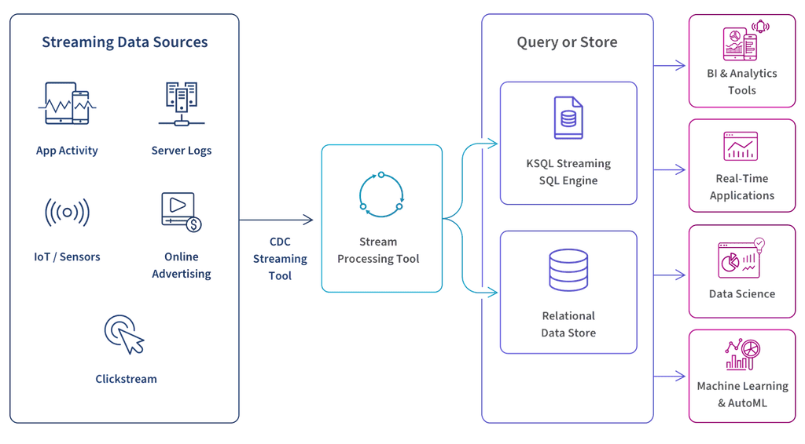

# Overview

<figure><figcaption>
Streaming Data
</figcaption></figure>

> **Note:** **Streaming Data**
>
> Streaming data represents a continuous flow of information generated in real-time from various sources like IoT devices, social media feeds, financial transactions, or sensor networks. Unlike traditional batch processing where data is collected and analyzed in fixed chunks, streaming data arrives as an unbounded sequence of events that must be processed on the fly.
>
> This real-time nature presents unique challenges in data processing, storage, and analysis, but also enables organizations to gain immediate insights and respond to changing conditions as they happen.
>
> Pentaho Data Integration (PDI) offers robust capabilities for handling streaming data through its stream processing components. It provides a visual, drag-and-drop interface that simplifies the creation and management of streaming data pipelines. With PDI's streaming steps, organizations can easily consume data from various streaming sources, apply transformations in real-time, and load the processed data into target systems.
>
> The platform supports key streaming protocols and formats, including MQTT, JMS, and Kafka, allowing seamless integration with existing streaming infrastructure. PDI's ability to combine both batch and streaming processing in a single workflow makes it particularly valuable for organizations transitioning from traditional batch processing to more real-time data integration scenarios.

***

## Batch vs. streaming

The fundamental shift from batch to streaming is the move from a **bounded** dataset to an **unbounded** one.

| | Batch | Streaming |
| --- | --- | --- |
| **Data shape** | Finite — a file, a table, a query result | Infinite — an open-ended sequence of events |
| **When it runs** | On a schedule or on demand | Continuously, as events arrive |
| **Latency** | Minutes to hours | Sub-second to seconds |
| **Completion** | The job ends when the data is exhausted | The transformation stays running, waiting for the next event |
| **Typical use** | Nightly warehouse loads, reports | Sensor telemetry, fraud alerts, live dashboards |

## The PDI streaming pattern

Every streaming source in PDI — MQTT, Kafka, AMQP, JMS, Kinesis — follows the same **parent/child transformation** pattern:

* A **parent transformation** holds the streaming **consumer** step (for example *MQTT Consumer*, *Kafka Consumer*, *AMQP Consumer*). The consumer subscribes to the stream and collects incoming messages into **batches**.
* A **batch** is flushed to the child transformation whenever the first of two thresholds is reached:
  * **Duration (ms)** — a time window, or
  * **Number of records** — a message count.
* A **child transformation** processes each batch. It **must** start with the **Get records from stream** step, which surfaces the batched messages as rows. From there you parse, transform, and load the records like any other PDI stream.

This pattern means the same skills — JSON Input, Select values, Formula, Table output — apply to every protocol. Only the consumer step at the front changes.

> **Note:** **Get records from stream**
>
> This step produces rows and so must be the **first** step in the child transformation — it cannot sit mid-stream. To add streamed data to an existing stream, join it in with a join step.

## Protocols covered in this specialty

::: tabs

### MQTT

**Message Queuing Telemetry Transport** — a lightweight publish/subscribe protocol built for the Internet of Things (IoT). Minimal overhead makes it ideal for constrained devices and sensor networks. You will consume industrial robot-sensor telemetry from a **HiveMQ** broker and truck telemetry from an **EMQX** broker.

### AMQP

**Advanced Message Queuing Protocol** — a standardized broker protocol for reliable, decoupled messaging. You will consume room-sensor data from a **RabbitMQ** broker and append it to output files.

### Kafka

**Apache Kafka** — a distributed event-streaming platform for high-volume, fault-tolerant publish/subscribe pipelines. You will consume a real-time user-activity stream from Kafka (running in KRaft mode) and land it in a MySQL warehouse.

:::

> **Note:** Each topic in this course is a self-contained workshop. Work through them in order, or jump to the protocol that matches your environment.
