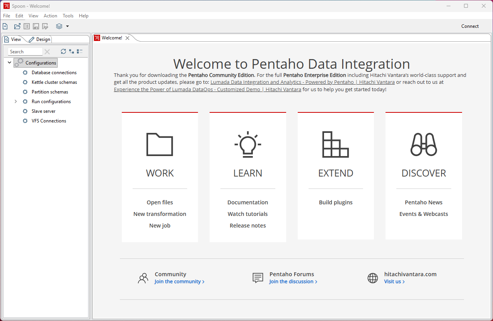

# Before You Arrive

> **Warning:**
>
> #### Get Ready — Before You Arrive
>
> This lab session moves fast: in two hours you'll build a real data
> pipeline, from first preview to a warehouse table that tracks
> history. To make that possible, **none of the two hours is spent on
> setup** — this page gets your machine ready in advance.
>
> **What you'll do**
>
> * Confirm Pentaho Data Integration (Developer Edition) starts.
> * Start the sample MySQL database.
> * Create the working folder the labs write into.
>
> **Prerequisites:** This machine (or lab VM) with PDI installed.
>
> **Estimated Time:** 10 minutes — before the session, not during it.

> **Note:** **About the software you're using.** Pentaho Data
> Integration **Developer Edition** is free for evaluation,
> development, and learning under the Business Source License 1.1 —
> production use requires a commercial licence. Everything you build
> today is real PDI: the same designer, the same engine, the same
> transformations you'd run in production. The last lab covers what
> "production" adds.

> **Note:** **A word on analytics.** This guide reports anonymous
> usage events (pages opened, steps completed, tools launched) so we
> can see where the lab flows well and where it doesn't. No names, no
> email addresses, and nothing you type is ever sent.

## Check your environment

This panel probes the machine live — PDI, the MySQL container, and
the container tooling that runs it. On a provided lab VM it should
be all green; anything red tells you the exact fix. The one that
matters most is **MySQL** — Lab 4 loads a table into it.

<div data-env-check="tryit"></div>

## Start Pentaho Data Integration

Click the button below. First launch can take a minute — PDI is a
full desktop designer, not a toy.

<button data-launch="spoon">Start Pentaho Data Integration</button>

You should see the **Spoon** welcome screen with an empty canvas.
Leave it open — Lab 1 starts here.


<p align="center"><em>Pentaho Developers Edition</em></p>

## Create the working folders

Your working area mirrors the course outline — one folder per
workshop, plus a shared `out\` for everything the pipelines write.
Open a terminal and create the tree in one go:

```powershell
mkdir C:\Workshop\pdi-2hr\02-see-it-work\02-build-the-pipeline, C:\Workshop\pdi-2hr\03-make-it-yours\03-enrich-and-join, C:\Workshop\pdi-2hr\03-make-it-yours\04-track-history, C:\Workshop\pdi-2hr\04-see-it-scale\05-one-pipeline-many-files, C:\Workshop\pdi-2hr\04-see-it-scale\06-your-data, C:\Workshop\pdi-2hr\out
```

On Linux or macOS:

```bash
mkdir -p ~/Workshop/pdi-2hr/{02-see-it-work/02-build-the-pipeline,03-make-it-yours/{03-enrich-and-join,04-track-history},04-see-it-scale/{05-one-pipeline-many-files,06-your-data},out}
```

Each lab tells you which folder its downloads belong in — matching
what you see in the course sidebar. The lab text uses the Windows
paths — substitute yours if you're elsewhere.

## Check the database

Lab 4 loads a dimension table into MySQL (the lab creates its own
tables, so no sample data needs loading). The environment panel
above shows **MySQL** green when the container is up — or test it
from a terminal:

```powershell
mysql -h localhost -P 3306 -u pentaho_admin -ppassword -e "SELECT 1;"
```

If MySQL isn't running and you're on a lab VM, run the provided
`setup-services` script, then click **Re-run checks** on the panel.

## Troubleshooting

<details>

<summary>Spoon doesn't start / closes immediately</summary>

PDI needs a Java runtime. Developer Edition bundles one; if you
installed manually, ensure `PENTAHO_JAVA_HOME` points at a Java 11+
JDK and start it via **Spoon.bat** (Windows) or **spoon.sh**
(Linux/macOS), not the jar directly.

</details>

<details>

<summary>The environment panel shows MySQL red</summary>

The database runs as a container. On a lab VM, run
`setup-services.ps1` from the scripts folder, wait for it to report
healthy, then click **Re-run checks**. On your own machine, any
MySQL 8 instance on `localhost:3306` with a user
`pentaho_admin`/`password` works — Lab 4 creates its own tables, so
no seeded sample data is required.

</details>

---

> **Tip:** That's it. When the session starts, you'll go from zero to
> a running pipeline in under ten minutes — because you did this page
> first.
