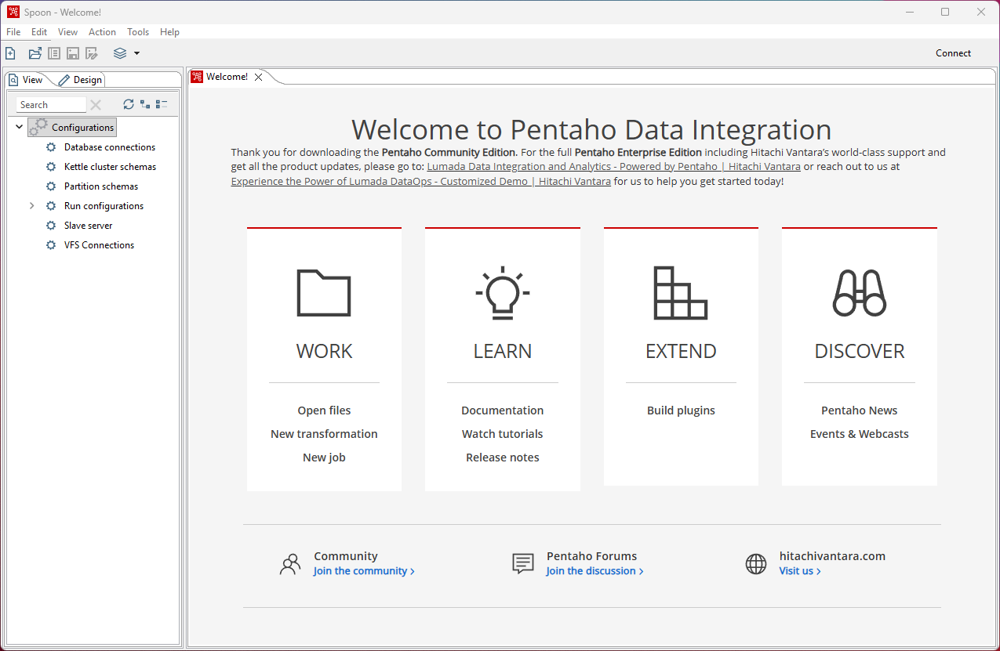

# Before You Start

> **Note:**
>
> #### Get Ready — Before You Start
>
> Before we start the course, let's check that your environment is
> ready and that you have access to the workshop folders and files.
> The session moves fast: in two hours you'll build a real data
> pipeline, from first preview to a warehouse table that tracks
> history, and **none of that time is spent on setup** — this page
> does it in advance.
>
> **What you'll do:**
> * Confirm Pentaho Data Integration (Developer Edition) starts.
> * Check the sample MySQL database is up and running.
> * Check the working folder: *C:\Workshop\pdi-2hr*
>
> **Prerequisites:** 
> - Familiarity with the basics of data integration
> - Familiarity with database management tool - DBeaver Community Edition
>
> **Estimated Time:** 5 minutes — before the session.

> **Note:** **About the software you're using.** Pentaho Data
> Integration **Developer Edition** is free for evaluation,
> development, and learning under the Business Source License 1.1 —
> production use requires a commercial license.
> 
> **Version:** 11.0.0.2-294

> **Note:** **A word on analytics.** This guide reports anonymous
> usage events (pages opened, steps completed, tools launched, using [G4 measurement protocol](https://developers.google.com/analytics/devguides/collection/protocol/ga4)) so we
> can see where the workshop flows well and where it doesn't. No names, no
> email addresses, and nothing you type is ever sent - only kept in-session memory.

> 
## Getting Started

The installer's **Workshop lab files** component lays this course's
lab files out in your working folder:

```text
C:\Workshop\pdi-2hr
```

Pentaho Data Integration itself is expected where the Pentaho 11
installer puts it, `C:\Pentaho\design-tools\data-integration`. The
**Start Pentaho Data Integration** button below and the machine check
look there first, then elsewhere on this machine.

## Check your environment

This panel probes the machine live — PDI, the MySQL container, and
the container tooling that runs it. Each row reports one of four states:

* **<span class="pcm-c-ok">Green</span>** — the check passed; that piece is present and answering.
* **<span class="pcm-c-warn">Amber</span>** — usable, but worth tidying before the session.
* **<span class="pcm-c-danger">Red</span>** — it will block a lab, and the row tells you the exact fix.
* **<span class="pcm-c-muted">Grey</span>** — skipped, because this course doesn't use it.

The one that matters most is **MySQL** — Lab 4 loads a table into it.

<div data-env-check="tryit"></div>

## Start Pentaho Data Integration

Click the button below to launch Pentaho Data Integration. First launch
can take a minute.

<button data-launch="spoon">Start Pentaho Data Integration</button>

You should see the **Spoon** welcome screen with an empty canvas.
Leave it open — Lab 1 starts here.
<figure>



<div align="center">
<figcaption><em>Pentaho Developers Edition</em></figcaption>
</div>
</figure>

## Check the working folders

Your working area follows the course outline, grouped into three
sections, plus a shared `out\` for everything the pipelines writes:

```text
C:\workshop\pdi-2hr
├── 02-see-it-work
│   ├── 01-your-first-win          Lab 1
│   └── 02-build-the-pipeline      Lab 2
├── 03-make-it-yours
│   ├── 03-enrich-and-join         Lab 3
│   └── 04-track-history           Lab 4
├── 04-see-it-scale
│   ├── 05-one-pipeline-many-files Lab 5
│   └── 06-your-data               Bring Your Own Data
└── out                            everything the pipelines write
```

**Confirm the files are there**, not just the folder — open
`02-see-it-work\01-your-first-win` and check you can see
`win_preview.ktr` and `sales_20260101.csv`. Lab 1 opens that
transformation in the first minute, so an empty folder is the one
thing worth catching now rather than then.

Each workshop displays the folder its files live in. The workshop uses Windows paths — substitute yours if located elsewhere.

## Check the database

workshop - Track History with One Step loads a dimension table into MySQL (seeded from a JSON file). 
The environment panel above shows **MySQL** green when the container is up and running.

These are: **Connection Details for workshop - Track History with One Step**

You don't need to provide the connection details for workshop - Track History with One Step - at this stage, but it's useful to know what they are.

|                 |                 |
| --------------- | --------------- |
| Host            | `localhost`     |
| Port            | `3306`          |
| Database        | `sampledata`    |
| Connection Name | `warehouse`     |
| Username        | `pentaho_admin` |
| Password        | `password`      |

## Troubleshooting <!-- no-step -->

<details>

<summary>Spoon doesn't start / closes immediately</summary>

PDI needs a Java runtime. Pentaho 11 bundles Java 21 in
`C:\Pentaho\java` and finds it by itself; if you installed PDI
elsewhere, ensure `PENTAHO_JAVA_HOME` points at a Java 21 JDK and
start it via **Spoon.bat** (Windows) or **spoon.sh** (Linux/macOS),
not the jar directly.

</details>

<details>

<summary>The environment panel shows MySQL red</summary>

The MySQL database runs in a container, and the container does not
start itself after a reboot. The setup script starts the Podman
machine, brings MySQL up and waits until it answers; it also puts the
MySQL JDBC driver into PDI if it is missing. It is safe to run at any
time.

**Start (or recreate) the container**

Open PowerShell and run the script from the app's `provisioning`
folder (the all-users install is shown; a just-for-me install has it
under `%LOCALAPPDATA%\Programs\Pentaho Content Manager\provisioning`):

```powershell
& "C:\Program Files\Pentaho Content Manager\provisioning\setup-services.ps1"
```

Wait for it to report that MySQL is answering, then click
**Re-check** in the panel above. A **Podman machine** row that says
*rootless* is fine: every port this course uses is above 1024.

**Test the Database Connection**

To verify the database connection, open a terminal and run:
```powershell
mysql -h localhost -P 3306 -u pentaho_admin -ppassword -e "SELECT 1;"
```

</details>

<details>

<summary>The environment panel shows the MySQL JDBC driver red</summary>

PDI 11 does not ship a MySQL driver, and Lab 4 cannot connect without
one. The installer downloads it from Maven Central into PDI's `lib`
folder when PDI is already installed; if you installed PDI afterwards,
the setup script above does the same the next time it runs, or run
the driver step on its own:

```powershell
& "C:\Program Files\Pentaho Content Manager\provisioning\install-pdi-driver.ps1"
```

Restart Spoon if it is open, then click **Re-check**.

**Note**
For the workshop step "Track History with One Step," you don't need any pre-seeded sample data — the lab creates its own tables as needed.

</details>

---

