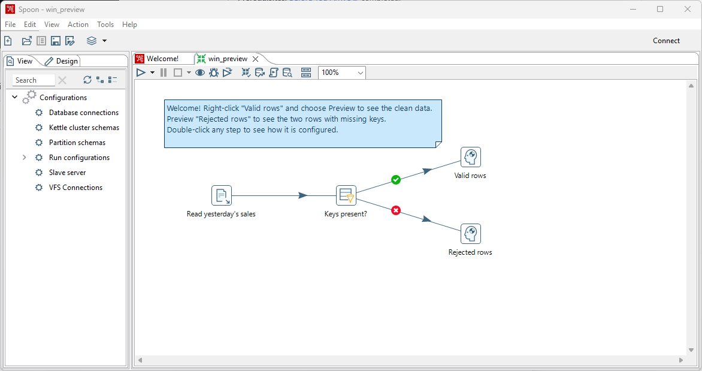
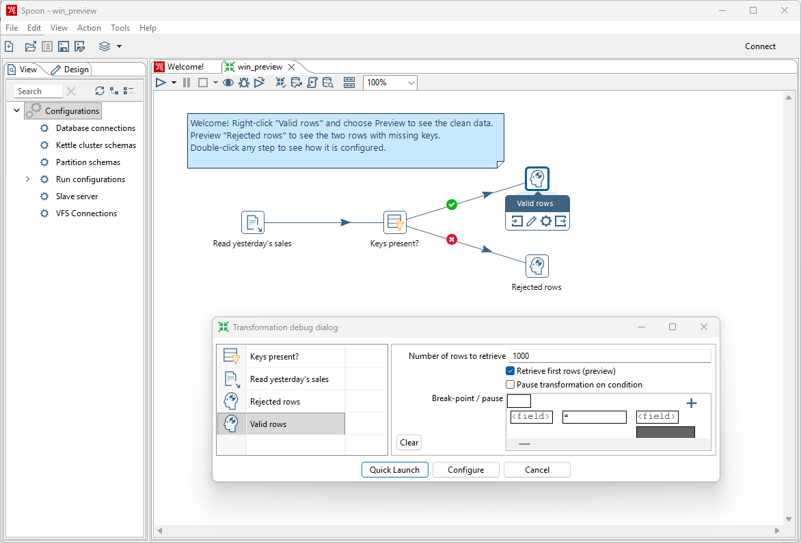
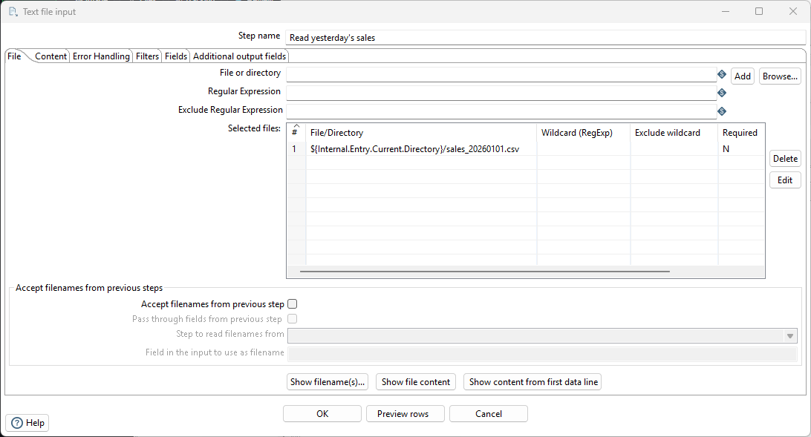
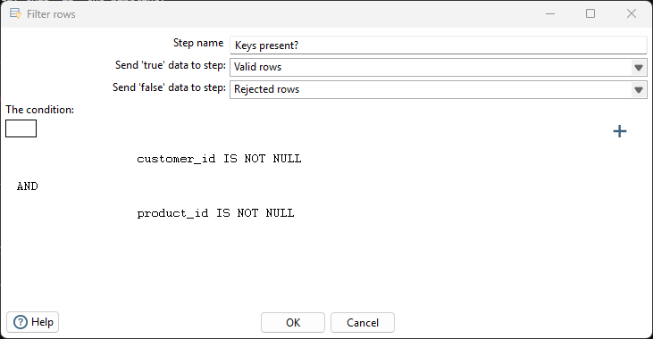
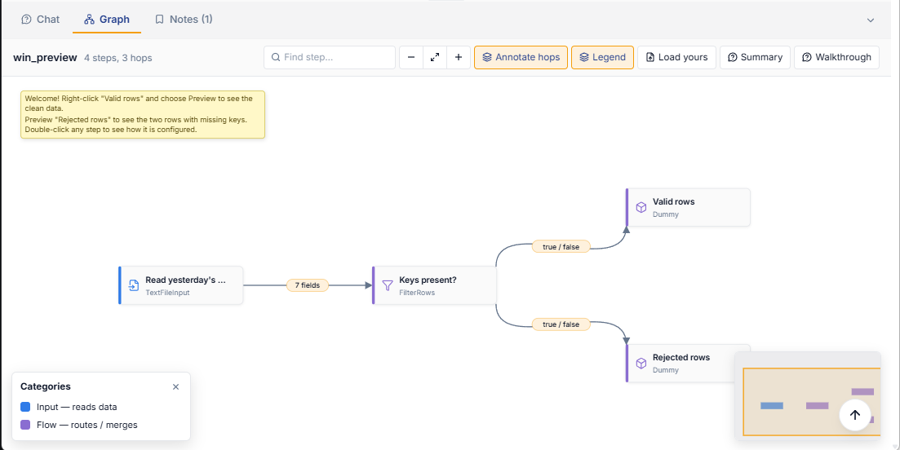

# Your First Win

> **Warning:**
>
> #### Workshop — Your First Win
>
> Before any theory, see the product do something. You'll open a
> finished pipeline, run it, and watch it separate good data from bad
> — in under ten minutes, without writing a line of code.
>
> **What you'll do**
>
> * Open a prepared transformation in PDI.
> * Preview live data at any point in the flow.
> * See two bad rows get caught automatically.
>
> **Prerequisites:** [Before You Arrive](../00-before-you-arrive/guide.md) completed.
>
> **Estimated Time:** 10 minutes

> **Note:** **The scenario for the next two hours.** You're the data
> engineer at a small retailer. Every morning, yesterday's sales must
> be validated, joined with customer and product master data, and
> loaded into the warehouse — with history tracked — by 9am. Today
> you build that pipeline. This lab shows you the finished first
> stage so you know where you're going.

## Open the pipeline

Click the button below — PDI opens with the transformation loaded.
(If PDI is already running, the file path is copied to your
clipboard: switch to PDI, press `Ctrl+O`, `Ctrl+V`, `Enter`.)

<button data-launch="spoon" data-path="files/win_preview.ktr">Open in Pentaho Data Integration</button>

You should see three connected steps on the canvas: a file reader, a
filter, and two end points — one for valid rows, one for rejects.

<em>win_preview.ktr</em>

## Preview the valid rows

1. **Right-click** the step named **Valid rows**.
2. Choose **Preview**, then **Quick Launch**.

<em>valid rows</em>

A grid appears with 37 of yesterday's orders — typed columns, parsed
dates, clean rows. This is the habit that changes how you build pipelines:
**you can look at the data at any step, at any time**, before
anything is written anywhere.

<em>preview rows</em>

## Preview the rejects

1. Close the preview.
2. **Right-click** **Rejected rows** → **Preview** → **Quick Launch**.

Three rows. Two are missing their `customer_id`, one its
`product_id` — they were planted in the file, and the filter caught
all three. In a hand-coded pipeline this is a try/except and a log
line you write yourself; here it's a visible branch in the flow you
can inspect.

## Look inside a step

Double-click **Read yesterday's sales**. This is the entire
configuration for parsing the file — delimiter, header, and on the
**Fields** tab, every column with its type and format. No code was
generated; this *is* the pipeline.

<em>Text file input </em>

Close the dialog with **Cancel** (so nothing changes).

Double-click **Keys present?*.
The Filter Rows step allows you to filter rows based on conditions and comparisons. 
In this example we're filtering for rows where the ids / keys are not null.

<em>Filter rows</em>

Close the dialog with **Cancel** (so nothing changes).

## See the flow as a diagram

The same file, rendered by this guide's built-in viewer — click any
step to see its configuration:

<button data-graph="files/win_preview.ktr">View graph</button>

<em>Graph</em>

Try out the other AI options:
Summary: summarized in a few sentences.
Walkthrough: Steep-by-step walkthrough of the transformation.

## Troubleshooting

Preview shows no rows / a file-not-found error

The transformation looks for `sales_20260101.csv` in the same folder
as the `.ktr` — this works when you opened it via the button above.
If you copied the `.ktr` elsewhere, copy the CSV (from **Lab Files**
below) next to it.

---

> **Tip:** Ten minutes in, you've run a pipeline, previewed data
> mid-flow, and caught bad rows. Next: build this exact
> transformation yourself, from an empty canvas — it takes about
> fifteen minutes.

## Lab Files

[sales_20260101.csv](./files/sales_20260101.csv)

[win_preview.ktr](./files/win_preview.ktr) <button data-launch="spoon" data-path="files/win_preview.ktr">Open in Pentaho Data Integration</button> <button data-graph="files/win_preview.ktr">View graph</button>
