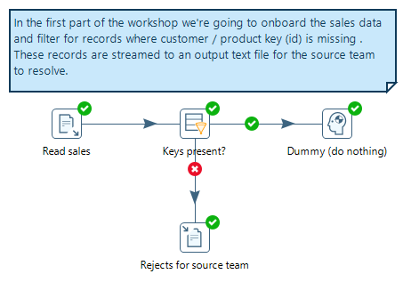
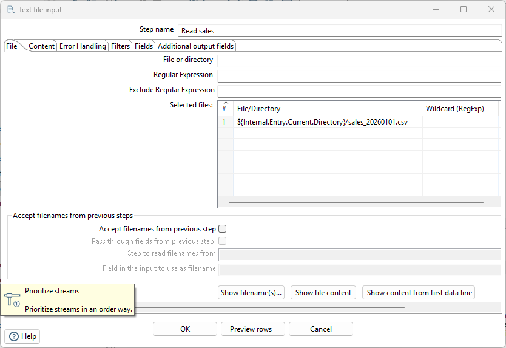
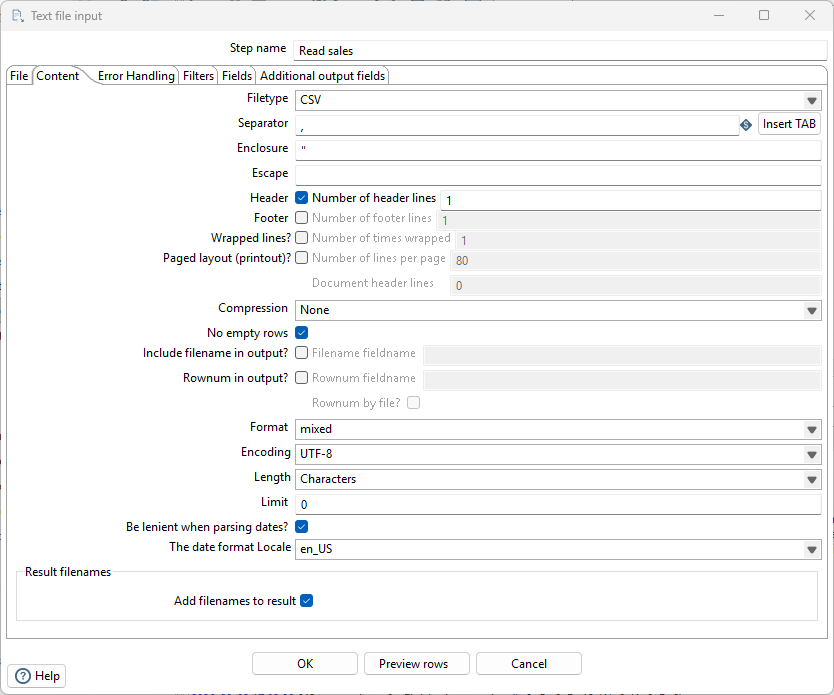
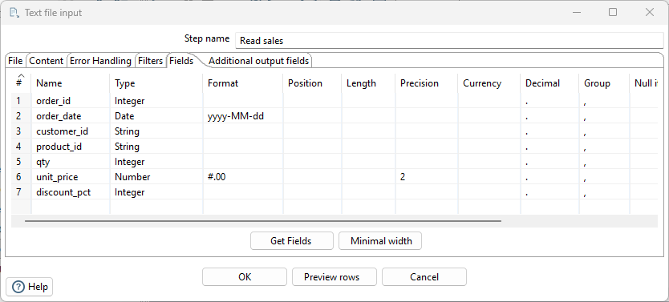
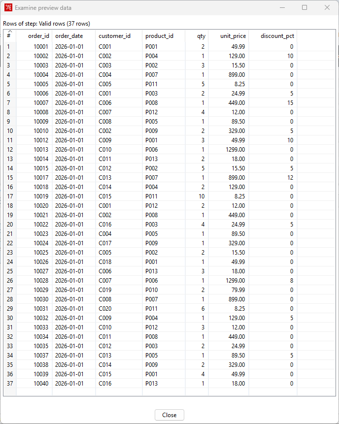
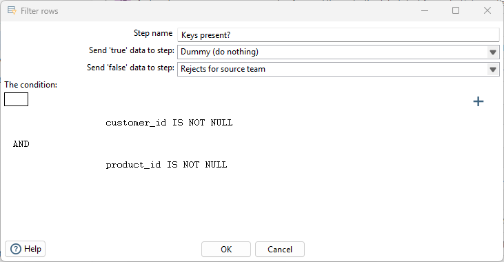

# Build the Pipeline Yourself

> **Warning:**
>
> #### Workshop — Build the Pipeline Yourself
>
> Now you build what you just ran: read the sales file, validate it,
> and write the rejects to a file for the source team — from an empty
> canvas.
>
> **What you'll do**
>
> * Read a CSV with **Text file input** (and let PDI detect the columns).
> * Route rows with missing keys to a reject stream with **Filter rows**.
> * Write the rejects to a CSV with **Text file output**.
>
> **Prerequisites:** [Your First Win](../01-first-win/guide.md).
>
> **Estimated Time:** 15 minutes

> **Note:** **Get the data file first.** Check the file:
> `sales_20260101.csv` has been downloaded into the workshop folder:
> `C:\Workshop\pdi-2hr\02-see-it-work\02-build-the-pipeline\`.

<em>Onboard and filter sales data</em>

## Create a new transformation

In PDI: **File > New > Transformation** (or `Ctrl+N`). You get an
empty canvas and, on the left, the **Design** palette — every
capability of the engine, organised by category. familiarize yourself with some of the Steps.
Save the file/transformation (.ktr) as: C:\Workshop\pdi-2hr\02-see-it-work\02-build-the-pipeline\check_keys.ktr

## Read the file

1. In the Design palette, open **Input** folder and drag **Text file input**
   onto the canvas.
> **Note:** **Tip.** This is a steep learning curve, so use the 'Search' box to narrow down the hunt for the Step.
2. Double-click it. Name it `Read sales`.
3. On the **File** tab, click **Browse**, pick
   `C:\Workshop\pdi-2hr\02-see-it-work\02-build-the-pipeline\sales_20260101.csv`,
   then click **Add** so it appears in the *Selected files* grid.

<em>Add - sales data</em>

4. On the **Content** tab set:
   **Separator** to: comma and make sure 
   **Header** is ticked with 1 header line
   **Format** is: mixed
   **Encoding** is: UTF8

<em>Content tab</em>

5. On the **Fields** tab click **Get Fields** — PDI reads the file and detects every column and type for you. Accept the defaults.

<em>Content tab</em>

> **Note:** **Get Fields matters more than it looks.** You didn't
> declare a schema — the tool read the data and proposed one. In Lab
> 6 you'll point this same pipeline at *your own* file, and this
> button is why that works.

6. Click **Preview rows** at the bottom of the dialog — the same
   habit as Lab 1, available while you're still configuring.

<em>Preview rows</em>

7. Click **OK**.

> **Under the hood:**
>
> #### Get Fields wrote a contract, not just a grid
>
> PDI read the first rows of the file, inferred a name, type and
> format for every column, and stored that as the step's **row
> metadata** — the description of a row's shape that travels down
> the hops ahead of the data itself.
>
> That metadata is why the next step you add already knows
> `unit_price` is a number and `order_date` is a date, why Preview
> can show typed columns before anything is written, and why a
> mis-typed column is caught at design time instead of at 2am. You
> can edit any of it in the grid — the inference is a starting
> point, not a lock.
>
> **Why it matters:** you got a typed schema from a plain CSV in one
> click, without writing a DDL statement or a parser. Lab 6 points
> this same step at a file PDI has never seen, and it works for
> exactly this reason.

## Validate the keys

1. From **Flow**, drag **Filter rows** onto the canvas.
2. Draw a hop: hover over `Read sales`, drag from the output
   connector to the filter (or hold `Shift` and drag between steps).
3. Double-click the filter. Name it `Keys present?`.

<em>Filter keys</em>

4. Build the condition: click the left field and pick
   `customer_id`, set the function to `IS NOT NULL`.
5. Click **Add condition** (the + icon), set the second clause to
   `product_id IS NOT NULL`, joined with **AND**.
6. Click **OK**.

## Send the rejects to a file

1. From **Output**, drag **Text file output** onto the canvas.
2. Hop from `Keys present?` to it — when asked, choose the
   **FALSE** (result is false) branch.
3. Double-click it. Name it `Rejects for source team`. Set the
   **Filename** to `C:\Workshop\pdi-2hr\out\rejects` (PDI adds
   `.txt`; switch **Extension** to `csv` if you prefer).
4. On its **Fields** tab, click **Get Fields**, then **OK**.
5. From **Flow**, drag a **Dummy (do nothing)** step on, and hop the
   **TRUE** branch of the filter to it. Name it `Valid rows`.

## Run it

1. Click **Run** (the ▶ in the canvas toolbar), then **Run** again in
   the dialog.
2. Watch the **Step Metrics** tab fill in: 40 rows read, 37 valid,
   3 written to the reject file.
3. Open `C:\Workshop\pdi-2hr\out\rejects.csv` — there are your three
   bad rows, ready to send back to the source system's owner.

   * [ ] 40 rows read from the sales file.
   * [ ] 3 rows in the reject output.
   * [ ] Run finishes with no errors (all steps green-ticked).

> **Under the hood:**
>
> #### Every step ran at the same time
>
> Step Metrics tempts you to read the run top-to-bottom, as if the
> reader finished and then handed 40 rows to the filter. That isn't
> what happened. **All four steps started together**, each on its own
> thread, and rows flowed between them through small buffers — the
> filter was already sorting row 1 while the reader was still parsing
> row 20.
>
> This is why PDI is happy with files far larger than memory: only
> the rows in flight are held, never the whole dataset. The same
> transformation you just ran on 40 rows runs unchanged on 40
> million — you would wait longer, but nothing about the design
> changes.
>
> **Why it matters:** the parallelism is free and automatic. Nobody
> wrote a thread pool, a queue, or a batch size — you drew boxes and
> arrows, and the engine turned that into a concurrent pipeline.

## Troubleshooting

The hop dialog didn't ask TRUE or FALSE

Right-click the hop between the filter and the output step and
choose which result to send down it — or right-click the filter step
and set **Define error/result targets**. TRUE and FALSE hops are also
editable inside the Filter rows dialog (the two "Send ... rows to"
dropdowns at the top).

Get Fields typed a column wrong

Fix it in the grid — that's the point of the grid. Common case:
`order_date` should be `Date` with format `yyyy-MM-dd`.

---

> **Tip:** You've built and run a validating ingest in one lab. Note
> what you did *not* do: define schemas by hand, write parsing code,
> or deploy anything to test it. Next, the payoff step — joining
> three sources of three different shapes on one canvas.

## Lab Files

[sales_20260101.csv](./files/sales_20260101.csv)

### Solution

Stuck, or want to compare? The complete transformation — it expects
the data file in the workshop folder.

[solution_build_pipeline.ktr](./files/solution_build_pipeline.ktr) <button data-launch="spoon" data-path="files/solution_build_pipeline.ktr">Open in Pentaho Data Integration</button> <button data-graph="files/solution_build_pipeline.ktr">View graph</button>
