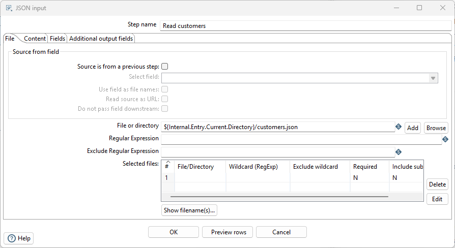
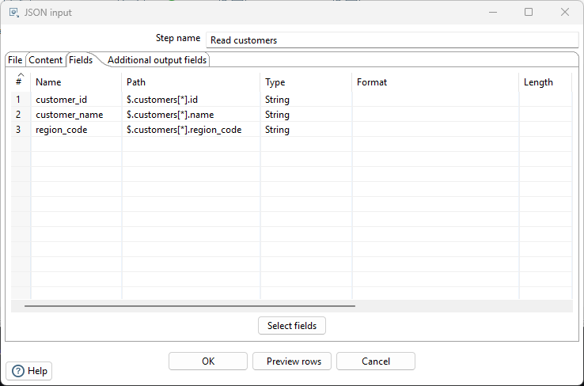
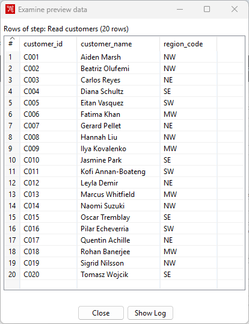
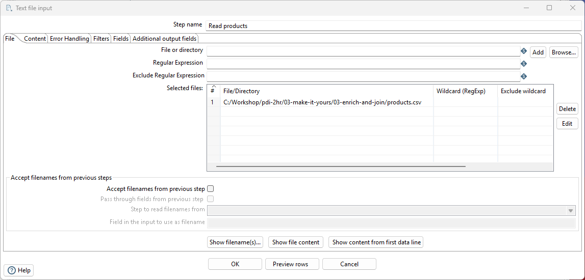
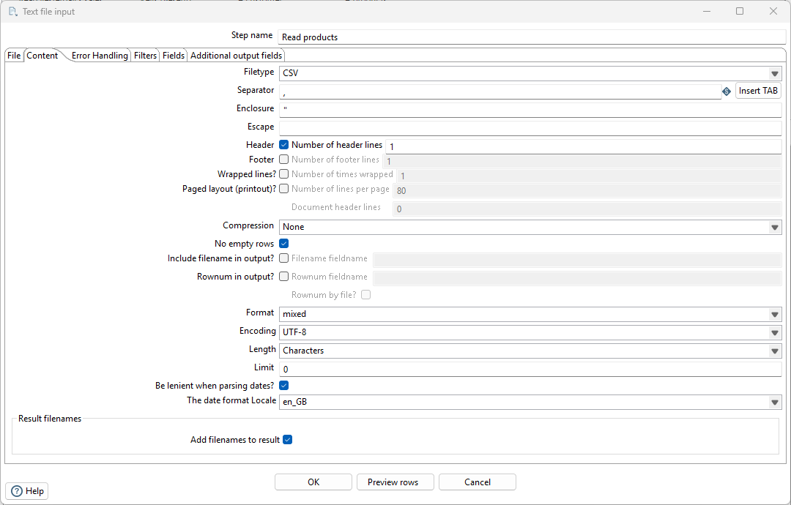
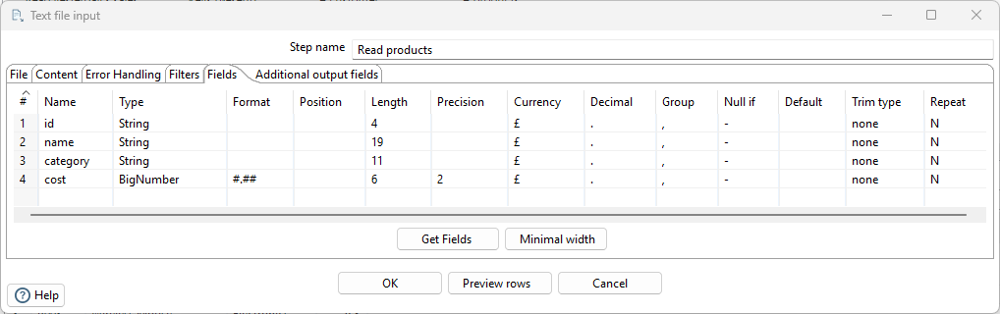
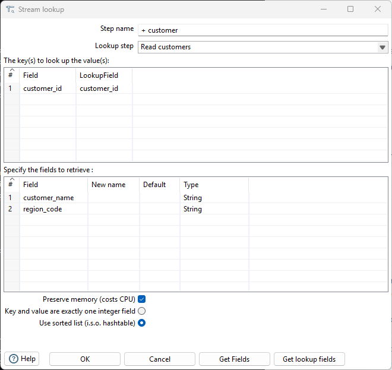
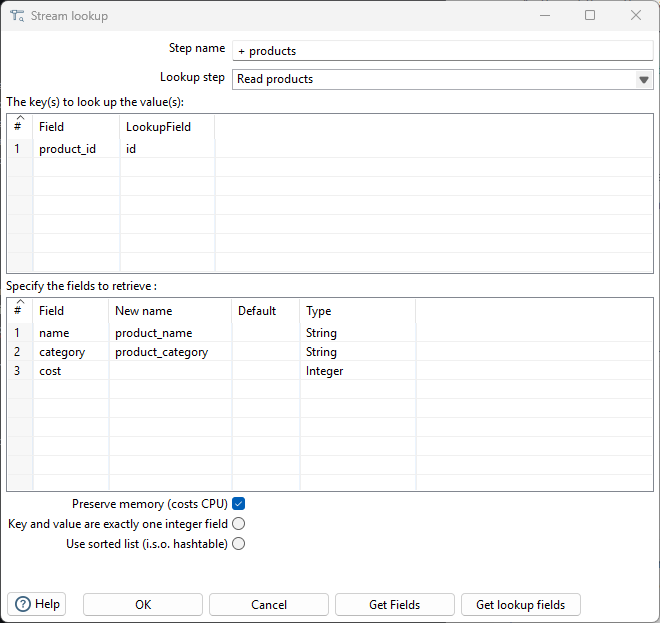
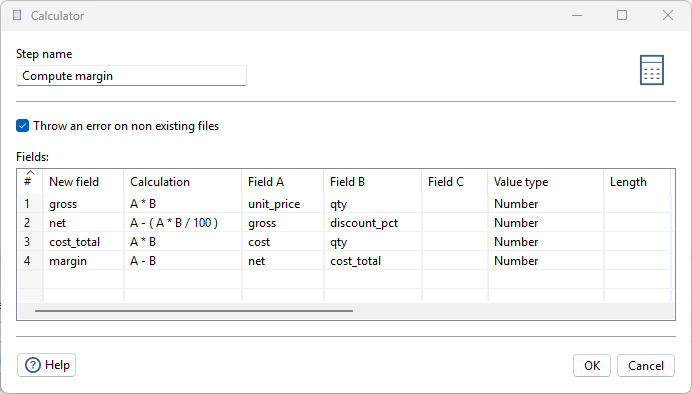
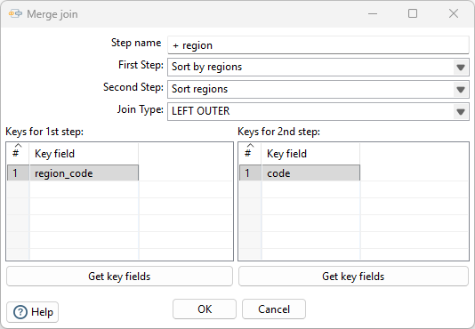

# Enrich and Join

> **Warning:**
>
> #### Workshop — Enrich and Join
>
> Real pipelines mix formats: your sales arrive as CSV, the customer
> master is JSON from an API export, the product catalogue and the
> region reference are more CSVs. You'll bring all four together on
> one canvas — two ways, because PDI gives you two tools for it — and
> compute a margin, with no staging tables and no format wrangling.
>
> **What you'll do**
>
> * Read JSON with **JSON input** and a JSONPath expression.
> * Enrich with **Stream lookup** — the in-memory lookup for small reference sets.
> * Compute revenue and margin with **Calculator**.
> * Join with **Merge join** — a true SQL-style join (inner / left / right / full) over two sorted streams — and learn when to reach for which.
>
> **Prerequisites:** [Build the Pipeline Yourself](../02-build-the-pipeline/guide.md) — you'll extend that transformation.
>
> **Estimated Time:** 20 minutes

> **Note:** **Get the files first.** Check `customers.json`,
> `products.csv`, and `regions.csv` have been downloaded into
> this lab's workshop folder:
> `C:\Workshop\pdi-2hr\03-make-it-yours\03-enrich-and-join\`.

## Read the customer master (JSON)

1. Open your Lab 2 transformation and save it as
   `enrich_sales.ktr` (**File > Save as**).
2. From **Input**, drag **JSON input** onto an empty part of the
   canvas.
3. Double-click it. Name it `Read customers`. On the **File** tab,
   browse to
   `C:\Workshop\pdi-2hr\03-make-it-yours\03-enrich-and-join\customers.json`
   and **Add** it.

<em>customers.json</em>

4. On the **Fields** tab, add rows — one per field. **Path** uses
   JSONPath, relative to the array of customer objects:

| Name | Path | Type |
| --- | --- | --- |
| customer_id | $.customers[*].id | String |
| customer_name | $.customers[*].name | String |
| region_code | $.customers[*].region_code | String |

<em>Fields - customers.json</em>

5. Click **Preview rows** — 20 customers. The nested JSON is now
   just another stream of rows, identical in kind to the CSV stream.

<em>Preview - customers.json</em>

## Read the product catalogue

1. Drag another **Text file input** on. Name it `Read products`.
2. Point it at
   `C:\Workshop\pdi-2hr\03-make-it-yours\03-enrich-and-join\products.csv`.

<em>Add - products.csv</em>

3. Click the Content tab: 
   -   **Separator:** comma
   -   **Header:** ticked - Number of header lines 1
   -   **Format:** mixed
   -   **Encoding:** UTF8

<em>Content - products.csv</em>

4. Click on the Fields tab:
   **Get Fields**

<em>Fields - products.csv</em>

## Enrich with two lookups

**Stream lookup** enriches a main stream with fields fetched from a
second stream. It loads the lookup stream into memory once, then
matches each main row by key — perfect for small reference sets like
a customer master or a product catalogue. It is *not* a join: one
match per row, no outer semantics, and the whole lookup set must fit
in memory. You'll meet the real join in a moment.

1. From **Lookup**, drag **Stream lookup** on. Name it
   `+ customer`.
2. Hop from `Valid rows` (your Lab 2 TRUE branch) into it, and a
   second hop from `Read customers` into it.
3. Double-click it: set **Lookup step** to `Read customers`; in
   *keys to look up*, match `customer_id` = `customer_id`; in
   *fields to retrieve*, add `customer_name` and `region_code`.

<em>+ customers lookup</em>

4. Repeat the pattern: another **Stream lookup** named `+ product`,
   fed by `+ customer` and `Read products`, matching `product_id` =
   `id`, retrieving `name` (rename to `product_name`), `category`,
   and `cost`.

<em>+ products lookup</em>

> **Under the hood:**
>
> #### A hash table, built once, probed 37 times
>
> Stream lookup reads its *lookup* stream to completion first and
> builds a hash table in memory, keyed on the fields you matched on.
> Then each main row arrives and costs a single hash probe —
> constant time, no re-reading, no query per row.
>
> Notice what that means for the JSON: by the time the lookup sees
> it, `customers.json` isn't JSON any more. The JSON input step
> turned it into rows with typed columns, and from there it is
> indistinguishable from the CSV. **Format is a property of the
> Input step, not of the pipeline.**
>
> **Why it matters:** joining a JSON API export to a CSV normally
> means landing both somewhere they can be queried together. Here
> the "somewhere" is the engine's own memory, for the few seconds
> the run lasts — no staging tables, no database round trip, and one
> canvas that reads as the whole story.

## Compute revenue and margin

1. From **Transform**, drag **Calculator** on, hopped from
   `+ product`.
2. Add four calculations (each row can use an earlier row's result):

<em>Compute margin</em>

| New field | Calculation | Field A | Field B | Type |
| --- | --- | --- | --- | --- |
| gross | A * B | unit_price | qty | Number |
| net | A - ( A * B / 100 ) | gross | discount_pct | Number |
| cost_total | A * B | cost | qty | Number |
| margin | A - B | net | cost_total | Number |

> **Note:** **Field A sets the arithmetic type.** Put the decimal
> field first: `qty * unit_price` (Integer first) silently rounds
> the price to a whole number before multiplying — `unit_price *
> qty` keeps the pennies. If you'd rather write it as one formula,
> the **Formula** step accepts spreadsheet-style expressions like
> `[net]-[cost]*[qty]`.

3. Preview the Calculator step: every sale now carries the customer,
   region code, product, category — and a margin figure that never
   existed in any source file.

## Join the region reference (a real join)

Each sale now has a `region_code`, and `regions.csv` says what that
code means — its name and the manager who owns the number. Time for
an actual join.

**Merge join** is PDI's SQL-style join: two streams, matched on keys,
with **INNER / LEFT OUTER / RIGHT OUTER / FULL OUTER** semantics, and
it streams — neither side has to fit in memory. The price of that
scalability is one rule: **both inputs must arrive sorted on the join
keys**, so a Merge join is almost always preceded by two **Sort rows**
steps.

1. Drag another **Text file input** on. Name it `Read regions`, point
   it at `regions.csv` in this lab's folder, header ticked, and on
   **Fields** tab add three String fields - ***Get fields***: `code`,
   `region_name` (rename from 'name'),`manager_email`.
2. From **Transform**, drag on two **Sort rows** steps:
   * `Sort regions` — hopped from `Read regions`, sorting on `code`.
   * `Sort by region` — hopped from `Compute margin`, sorting on
     `region_code`.
3. From **Joins**, drag on **Merge join**. Name it `+ region`. Hop
   both sort steps into it, then double-click it:
   * **First step:** `Sort by region` · **Second step:** `Sort regions`
   * **Join type:** `LEFT OUTER`
   * **Keys for 1st step:** `region_code` · **Keys for 2nd step:** `code`

<em>+ region - merge join</em>

4. Preview `+ region`: every sale now also carries `region_name` and
   `manager_email`.

> **Under the hood:**
>
> #### Why the join demands sorted input
>
> Merge join keeps one row from each side and walks the two streams
> forward in lock-step, like merging two sorted lists: compare the
> keys, emit a match, advance whichever side is behind. It only ever
> holds the current rows — which is exactly why neither input has to
> fit in memory, and exactly why both must already be sorted. Hand
> it unsorted rows and it doesn't error; it just walks past matches
> it can no longer see.
>
> That is the trade the two steps on your canvas represent. Stream
> lookup buys speed by holding one side in RAM; Merge join buys
> unlimited size by requiring order. **Sorting is the price of
> scale**, and PDI makes you pay it explicitly rather than hiding a
> memory cliff behind a friendly step.
>
> **Why it matters:** this is a genuine relational join — inner,
> left, right or full — executed on rows in flight, against sources
> that were a CSV, a JSON export and another CSV minutes ago. No
> database was involved in doing it.

> **Note:** **Why LEFT OUTER?** A sale whose region code has no entry
> in `regions.csv` must still reach the warehouse — with the region
> columns empty — rather than silently vanish. INNER would drop it.
> That choice is the whole difference between "some sales went
> missing" and "some sales need a region added"; make it
> deliberately, every time.

## Lookup or join?

Your canvas now has both, side by side, on the same data — so this is
the moment the difference sticks. They look interchangeable in a
screenshot; they are not.

| | **Stream lookup** | **Merge join** |
| --- | --- | --- |
| What it is | An in-memory hash lookup | A true SQL-style join |
| Input order | Any — no sorting needed | **Both streams must be sorted on the keys** |
| Memory | The whole lookup stream is held in RAM | Streams both sides; neither has to fit |
| Rows out | Never more than you put in | Can **multiply** rows — one left row × N matches |
| No match | Row continues, fields null (or your default) | Depends on join type: dropped (INNER) or kept (OUTER) |
| Join types | One behaviour only | INNER, LEFT / RIGHT / FULL OUTER |
| Reach for it when | The reference set is small and stable — a customer master, a product catalogue, a code table | Either side is large, you need outer semantics, or a key can legitimately match many rows |

Three practical consequences worth carrying home:

* **A lookup can't lose a row; a join can.** That's why an INNER Merge
  join is where sales quietly disappear — and why we chose LEFT OUTER
  above.
* **A lookup can't duplicate a row; a join can.** If a Merge join
  returns more rows than it took in, your "reference" table has
  duplicate keys.
* **Sorting is the join's real cost.** Two Sort rows steps for a
  five-row region file looks like overkill — and it is. That's exactly
  why the customer and product enrichments upstream use lookups
  instead. Pick per case, not per habit.

> **Note:** PDI has more joining steps than these two — **Database
> lookup** (query a table per row), **Database join** (a
> parameterised query per row), **Merge rows (diff)** for change
> detection, and **Join rows** for a deliberate Cartesian product.
> The two on your canvas are the ones you'll reach for most.

* [ ] Preview shows 37 enriched rows.
* [ ] `gross` keeps its pennies (row 1 is 99.98, not 100).
* [ ] `margin` is populated and plausible (mostly positive).
* [ ] `region_name` and `manager_email` are filled on every row.

## Troubleshooting

Stream lookup returns nulls for every row

The key fields must match in type and value. `customer_id` in sales
and `id` in the JSON are both strings like `C001` — if you renamed
fields differently in Lab 2, adjust the key mapping in the lookup
dialog.

JSON input preview is empty

Check the Path column: it must start `$.customers[*]` — the array is
under the top-level `customers` key, not at the root.

Merge join returns nothing, or drops most rows

Almost always unsorted input. Merge join walks both streams in step
and assumes each is already ordered by its keys — feed it unsorted
rows and it silently mismatches. Check that both **Sort rows** steps
are hopped in *before* the join, and that each sorts on the field
named in its side of the key mapping (`region_code` on the sales
side, `code` on the regions side).

The output has both region_code and code

Expected — a join keeps the key column from *each* side, exactly as
`SELECT *` across two tables would. Add a **Select values** step
after the join to drop the duplicate (and to put the final column
list in the order you want).

---

> **Tip:** Four sources, one canvas, zero staging — two lookups and a
> real outer join. The equivalent in SQL alone means loading all four
> into a database first; in code it means four parsers and a join you
> maintain forever. Next: load the warehouse — with history.

## Lab Files

[customers.json](./files/customers.json)

[products.csv](./files/products.csv)

[regions.csv](./files/regions.csv)

### Solution

The complete transformation — two Stream lookups, the Calculator,
and the LEFT OUTER Merge join onto the region reference. Expects the
data files in the 02 and 03 workshop folders.

[solution_enrich_sales.ktr](./files/solution_enrich_sales.ktr) <button data-launch="spoon" data-path="files/solution_enrich_sales.ktr">Open in Pentaho Data Integration</button> <button data-graph="files/solution_enrich_sales.ktr">View graph</button>
