# One Pipeline, Many Files

> **Warning:**
>
> #### Workshop — One Pipeline, Many Files
>
> Your regions all send daily sales — but the north sends
> comma-separated CSV, the south pipe-delimited text, and the EU
> partner semicolons. The usual answer is one pipeline per feed,
> maintained forever. PDI's answer is **metadata injection**: one
> *template* pipeline whose configuration is filled in at runtime
> from a control file.
>
> **What you'll do**
>
> * Build a template transformation with a deliberately unconfigured reader.
> * Build an injection transformation that fills the template in at runtime.
> * Drive it from a small job — one run per control-file row.
> * Ingest three differently-shaped files through one pipeline — then add a fourth by editing a CSV, not a pipeline.
>
> **Prerequisites:** [Build the Pipeline Yourself](../02-build-the-pipeline/guide.md).
>
> **Estimated Time:** 20 minutes

<figure>

<figcaption class="pcm-video-caption">Watch: Metadata Injection</figcaption>

</figure>

> **Note:** **Get the files first.** Download the three feed files
> and `control.csv` from **Lab Files** below into
> this module's workshop folder:
> `C:\Workshop\pdi-2hr\04-see-it-scale\05-one-pipeline-many-files\`. 
> - Take a look at the 3 store files: different headers and delimiters.
> - Open `control.csv` — one row per feed: the file's full path and its
> separator. That file *is* the configuration; the pipelines you
> build next never change again.

Before we build anything, let's take a look at the store files:

<figure style="flex:0 1 auto; margin:0">

<figcaption><em>stores_north.csv</em></figcaption>

</figure>
<figure style="flex:0 1 auto; margin:0">

<figcaption><em>stores_south.txt</em></figcaption>

</figure>
<figure style="flex:0 1 auto; margin:0">

<figcaption><em>partners_eu.csv</em></figcaption>

</figure>

So all we need to do is pick up the filename, its associated delimiter and standardize the header - <em>control.csv</em>:

<figure>

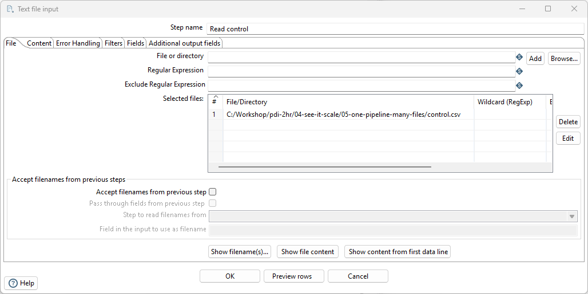

<figcaption><em>Pass filename & separator - control.csv</em></figcaption>

</figure>

> **Note:** **The shape of the solution.** One injection run
> configures the template once — so to process many differently-
> configured feeds, a small **job** runs the injection once per
> control row. Three pieces: the *template* (the reusable pipeline),
> the *injector* (fills the template in and runs it), and the
> *driver job* (loops the injector over control.csv). This is also
> your first look at a job — the orchestration layer Lab 7 talks
> about.

:::: tabs

### 1. The template

<figure>

<figcaption><em>Template - Injects filename and delimiter</em></figcaption>
</figure>

1. New transformation, saved as
   `C:\Workshop\pdi-2hr\04-see-it-scale\05-one-pipeline-many-files\mi_template.ktr`.
2. Drag on a **Text file input**. Name it `Read feed`. 
   - On **Fields**, add three **String** fields by hand: `col_store`,
   `col_date`, `col_amount` (the feeds all share this column
   *order*, whatever the columns are called). 
   - On **Content**, make sure **Header** is ticked. Select **No empty rows** — that's
   injected at runtime.

<figure>

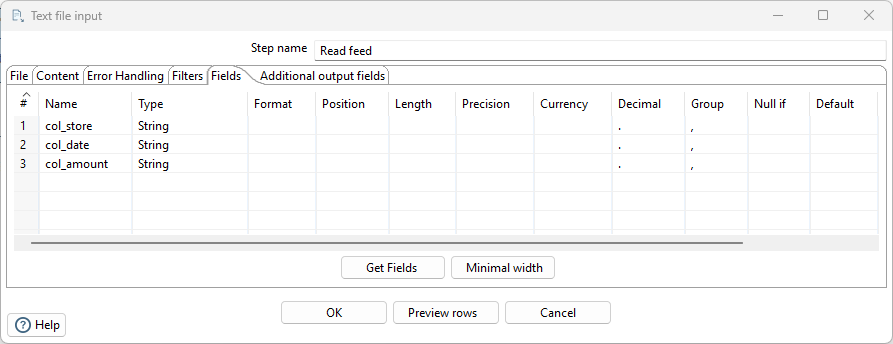

<figcaption><em>Edit the column headers</em></figcaption>

</figure>

3. Drag on a **Select values** step, hopped from `Read feed`. Name
   it `Standardise`. On **Select & Alter**, rename
   `col_store → store`, `col_date → sale_date`,
   `col_amount → amount`.

<figure>

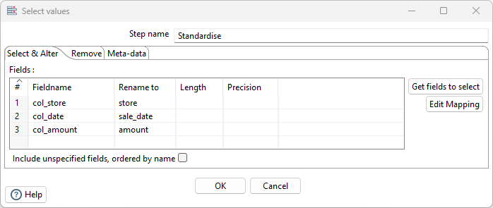

<figcaption><em>Rename fields</em></figcaption>

</figure>

4. Drag on a **Text file output**, hopped from `Standardise`.
   Filename `C:\Workshop\pdi-2hr\out\all_feeds`, extension `csv`.
<figure>

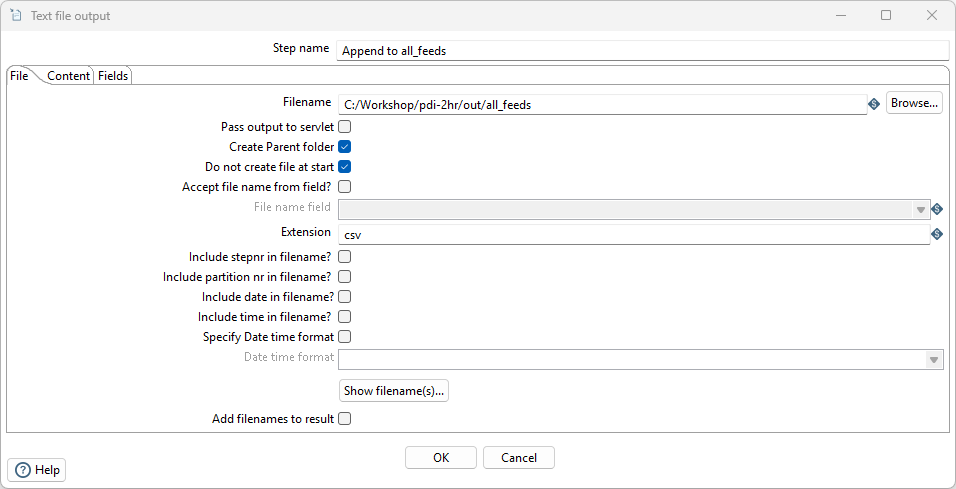

<figcaption><em>Output path</em></figcaption>

</figure>

   - On **Content**: tick **Append**, untick **Header**. On
   **Fields**: add `store`, `sale_date`, `amount`.
<figure>

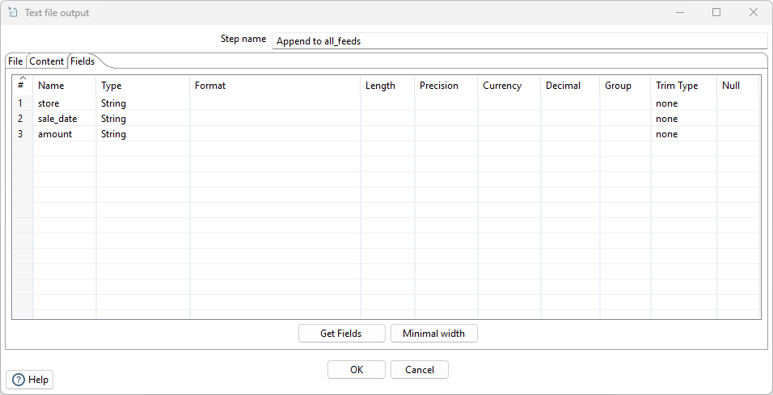

<figcaption><em>Get fields</em></figcaption>

</figure>

5. Save. This transformation can't run on its own — that's the
   point.

### 2. The injector

<figure>

<figcaption><em>Metadata Injector</em></figcaption>

</figure>

1. New transformation, saved as `mi_inject.ktr` in the same folder.

<figure>

<figcaption><em>Add data stream fields for filename and separator</em></figcaption>

</figure>

2. Drag on **Get rows from result** (from *Job*). 
   - Name it `File config`. 
   - Add its two fields: `filename` and `separator`, both String. 
   When the driver job executes this transformation
   once per control row, *this step is where that row arrives*.
<figure>

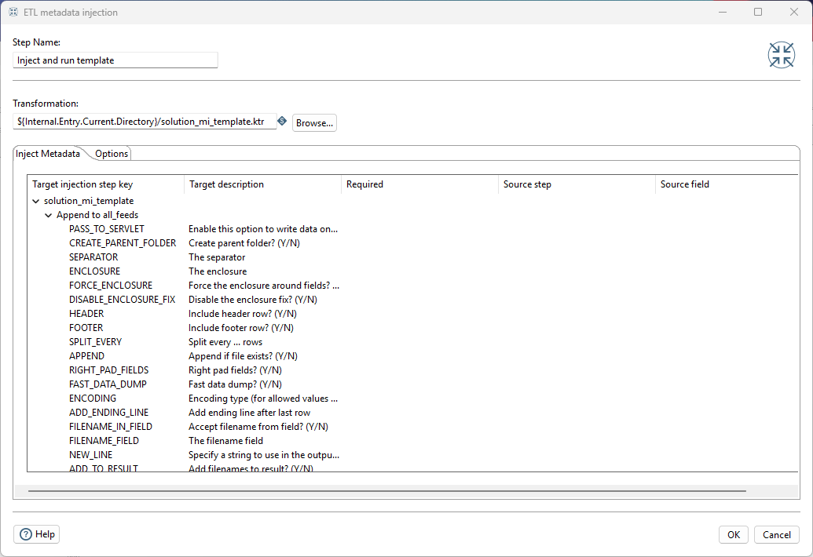

<figcaption><em>Template metadata properties</em></figcaption>

</figure>

3. From **Flow**, drag on **ETL metadata injection**, hopped from
   `File config`. 
   - Double-click it and browse to `mi_template.ktr` —
   the dialog shows every injectable property of every template
   step, as a tree.
4. Wire two injections on the `Read feed` step: **FILENAME** ←
   `File config` / `filename` (it's under the file *list*, so it
   accepts one entry per row), 
<figure>

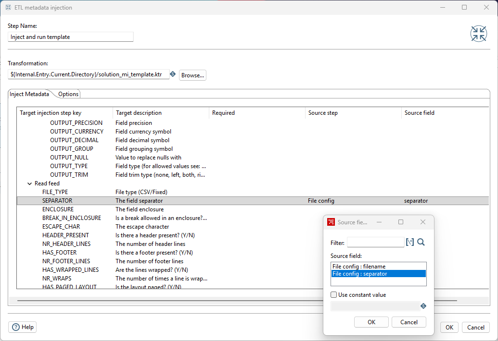

<figcaption><em>Inject the separator from the File config step</em></figcaption>

</figure>

and **SEPARATOR** ← `File config` / `separator`. Leave everything else alone.

<figure>

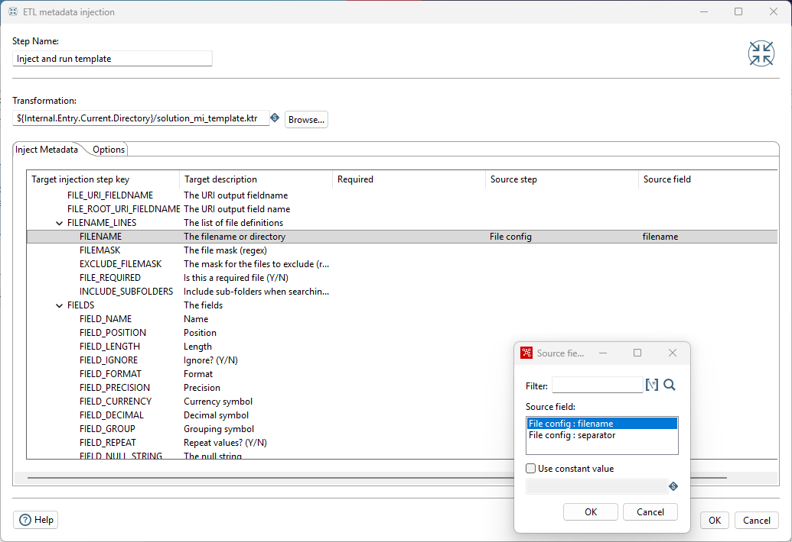

<figcaption><em>Inject the filename from the File config step</em></figcaption>

</figure>

> **Tip:**
>
> If you accidentally select the wrong property, then highlight and click Cancel to remove.

5. Save.

### 3. The driver job
<figure>

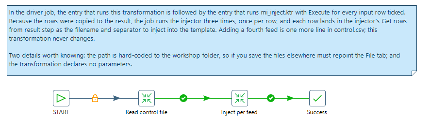

<figcaption><em>Job - mi_driver.kjb</em></figcaption>

</figure>

1. **File > New > Job**, saved as `mi_driver.kjb` in the same
   folder.
2. Drag on **START**, then two **Transformation** entries, then
   **Success**; hop them into a line.
<figure>

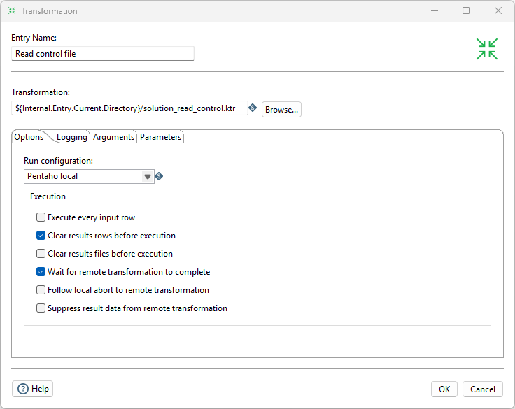

<figcaption><em>Read the control file</em></figcaption>

</figure>

3. First transformation entry → `read_control.ktr`: **Text file input** reading
   `control.csv` (fields `filename`, `separator`) hopped to **Copy
   rows to result** (from *Job*).
<figure>

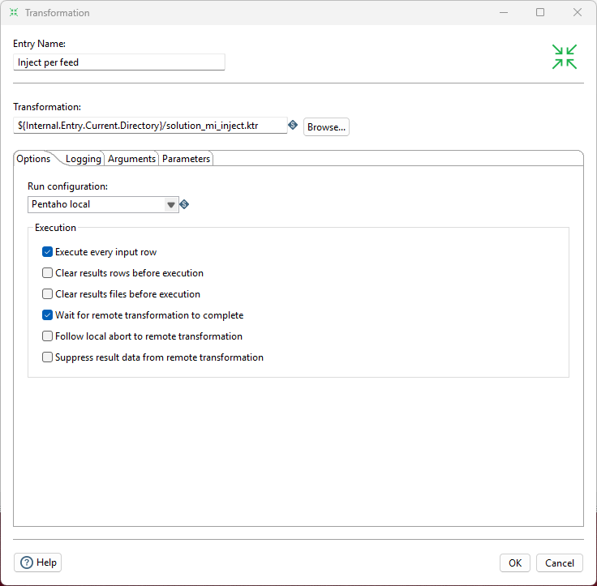

<figcaption><em>Inject metadata ..</em></figcaption>

</figure>

4. Second transformation entry → `mi_inject.ktr`. On its
   **Options** tab tick **Execute every input row** — each
   control row becomes one execution, delivered to the injector's
   `Get rows from result` step.

> **Under the hood:**
>
> #### Your first job
>
> Everything you have built so far was a transformation: rows flow
> through steps, and all the steps run at once. A **job** is the other
> kind of thing PDI runs, and it works differently. A job is a list of
> things to do one after another: run this transformation, then that
> one, then send an email if something failed. Its boxes are called
> **entries** rather than steps, and its hops carry no rows; they say
> what happens next. A hop can be unconditional (always carry on),
> follow only on success (green in Spoon), or follow only on failure
> (red). Saved, a job is a `.kjb` file, plain XML like a `.ktr`.
>
> Your driver job is the smallest useful one: START, an entry that runs
> the transformation reading `control.csv`, an entry that runs the
> injector, and Success. Two settings turn it into a loop. **Copy rows
> to result**, the last step of `read_control.ktr`, hands that
> transformation's rows back to the job. **Execute every input row**,
> on the second entry's Options tab, then runs `mi_inject.ktr` once per
> row, with that row delivered to its *Get rows from result* step.
>
> **Why it matters:** transformations move data; jobs decide the
> order, the repetition, and what happens when something goes wrong.
> Every scheduled pipeline you will ever run in PDI is a job wrapped
> around transformations, which is exactly what Lab 7 is about.

### 4. Run and extend

1. Delete `C:\Workshop\pdi-2hr\out\all_feeds.csv` if it exists (we
   append).
2. Run the **job**. Watch the log: the injector executes three
   times, once per control row.
<figure>

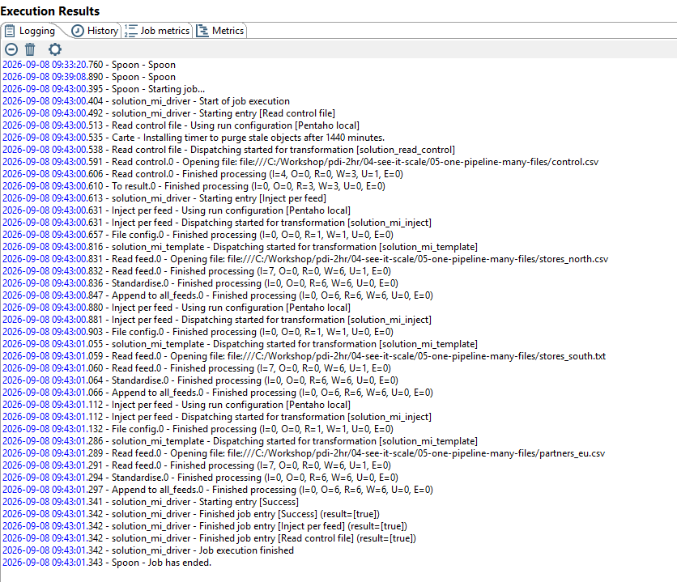

<figcaption><em>Notice its executed for each record</em></figcaption>

</figure>

3. Open `all_feeds.csv`: **18 rows** — north, south, and EU feeds,
   three shapes, one standard output.
<figure>

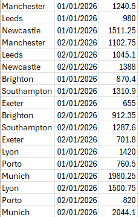

<figcaption><em>Output - records are appended</em></figcaption>

</figure>

Now the punchline:

4. Copy `stores_north.csv` to `stores_scotland.csv`, change the
   store names, and **add one line to `control.csv`** with its path
   and separator.
5. Run the job again. Four feeds. You did not open a pipeline.

> **Under the hood:**
>
> #### The template was rewritten in memory, once per feed
>
> Normally a transformation's settings, such as which file to read and
> which character separates its columns, are typed into its dialogs
> and saved in the file. **Metadata injection** means filling those
> settings in at run time instead, from data.
>
> That is what just happened. The **ETL metadata injection** step in
> `mi_inject.ktr` opened `mi_template.ktr` not to run it but to read
> it as a description, wrote the two values you mapped (the filename
> and the separator from the control row) into the template's reader
> step, and then ran that filled-in copy. The file on disk never
> changed; each control row got its own configured copy in memory.
>
> This works because a transformation is just a text file (Lab 1) and
> every setting in it has a name. Anything you can set in a dialog,
> injection can set: not only filenames and separators but whole
> column lists, so one template can take in feeds whose columns
> differ, not merely their delimiters.
>
> **Why it matters:** this is the difference between a tool and a
> platform. Your number of pipelines stops tracking your number of
> feeds; four feeds or four hundred, it stays one template, and the
> control file is something an operations team can own without ever
> opening Spoon, the designer you have been using today.

* [ ] `all_feeds.csv` contains rows from all three (then four) feeds.
* [ ] The new feed required editing only `control.csv`.

::::

## Troubleshooting

The injection dialog shows no injectable properties

You've browsed to the wrong file, or saved the template after the
dialog opened — reopen the ETL metadata injection dialog so it
re-reads the template.

The job runs but all_feeds.csv has rows from only one feed

The second transformation entry isn't iterating — check **Execute
every input row** is ticked on its Options tab, and that
`read_control.ktr` ends in **Copy rows to result**.

The EU feed's rows look wrong / arrive as one column

Its control row must carry `;` as the separator — check the
`separator` column parsed correctly (the comma row needs quoting:
`","`).

---

> **Tip:** Metadata injection is the difference between "an ETL tool"
> and "an ETL platform": pipelines as *data*, driven by a control
> table your operations team can edit. Teams use this exact pattern
> to onboard hundreds of feeds with one template. Next lab: your
> data goes through it.

## Lab Files

[control.csv](./files/control.csv)

[stores_north.csv](./files/stores_north.csv)

[stores_south.txt](./files/stores_south.txt)

[partners_eu.csv](./files/partners_eu.csv)

### Solution

Complete, working versions of all four pieces — download them into
`C:\Workshop\pdi-2hr\04-see-it-scale\05-one-pipeline-many-files\`
together (they reference each other by
folder) and run the job. Compare with your own build.

[solution_mi_driver.kjb](./files/solution_mi_driver.kjb) <button data-launch="spoon" data-path="files/solution_mi_driver.kjb">Open in Pentaho Data Integration</button> <button data-graph="files/solution_mi_driver.kjb">View graph</button>

[solution_mi_inject.ktr](./files/solution_mi_inject.ktr) <button data-launch="spoon" data-path="files/solution_mi_inject.ktr">Open in Pentaho Data Integration</button> <button data-graph="files/solution_mi_inject.ktr">View graph</button>

[solution_mi_template.ktr](./files/solution_mi_template.ktr) <button data-launch="spoon" data-path="files/solution_mi_template.ktr">Open in Pentaho Data Integration</button> <button data-graph="files/solution_mi_template.ktr">View graph</button>

[solution_read_control.ktr](./files/solution_read_control.ktr) <button data-launch="spoon" data-path="files/solution_read_control.ktr">Open in Pentaho Data Integration</button> <button data-graph="files/solution_read_control.ktr">View graph</button>
